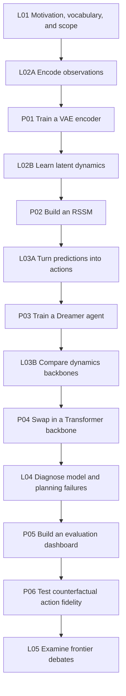

# Curriculum Roadmap

## One Path Through Lectures and Projects

The lectures and projects are one curriculum, not two separate tracks. Stop and complete each project when it appears in the path. The resulting checkpoint becomes the concrete object used in the next stage, so later ideas attach to a system you have already inspected and trained.

| Stage | Read | Then practice | What you should be able to explain afterward |
| --- | --- | --- | --- |
| Foundations | L01, then L02 Part A | [P01: Train a VAE Encoder](../../projects/p01_vae_encoder) | What information an observation encoder keeps and discards |
| Dynamics | L02 Part B and the Dreamer series | [P02: Build an RSSM](../../projects/p02_rssm_dynamics) | Why a useful latent state needs both memory and uncertainty |
| Control | L03 Part A | [P03: Train a Dreamer Agent](../../projects/p03_dreamer_agent) | How imagined trajectories train an actor and critic |
| Alternatives | L03 Part B | [P04: Swap the Dynamics Backbone](../../projects/p04_transformer_backbone) | Which bottleneck justifies replacing RSSM with another backbone |
| Evaluation | L04 | [P05: Build an Evaluation Dashboard](../../projects/p05_evaluation_dashboard) | Which metric diagnoses each representation, rollout, or planning failure |
| Causality | Revisit the L1-L5 ladder after L04 | [P06: Test Counterfactual Fidelity](../../projects/p06_counterfactual_world_model) | Whether actions causally change predicted futures rather than merely correlate with them |
| Frontier | L05 | No required project | Which open questions are empirical, architectural, or philosophical |

## Next Lecture

L02 starts from a concrete problem: **how do you compress a 64×64 pixel image into a compact latent vector z?** This is the task of the Variational Autoencoder (VAE), and it is the first building block of the entire Dreamer pipeline.

Complete P01 after the encoding section rather than waiting until the end of L02. Then return to the dynamics sections, connect the learned representation to an RSSM, and complete P02. By that point you will have written the two most important predictive components of the course and inspected how their errors change over a rollout.

*L01 requires no coding and treats its mathematical callouts as optional. L02 assumes fundamental deep learning knowledge and introduces the additional machinery when it is first needed.*

## Further Reading

- Craik, K.J.W. *The Nature of Explanation*. Cambridge University Press, 1943.
- [Ha & Schmidhuber (2018): World Models](https://arxiv.org/abs/1803.10122): the V/M/C three-module framework and the original paper on training in dreams
- [Hafner et al. (2019): Dream to Control (Dreamer V1)](https://arxiv.org/abs/1912.01603): the first end-to-end implementation of RSSM and latent actor-critic
- [LeCun (2022): A Path Towards Autonomous Machine Intelligence](https://arxiv.org/abs/2306.15364): the JEPA framework and the argument for world models as a cognitive core
