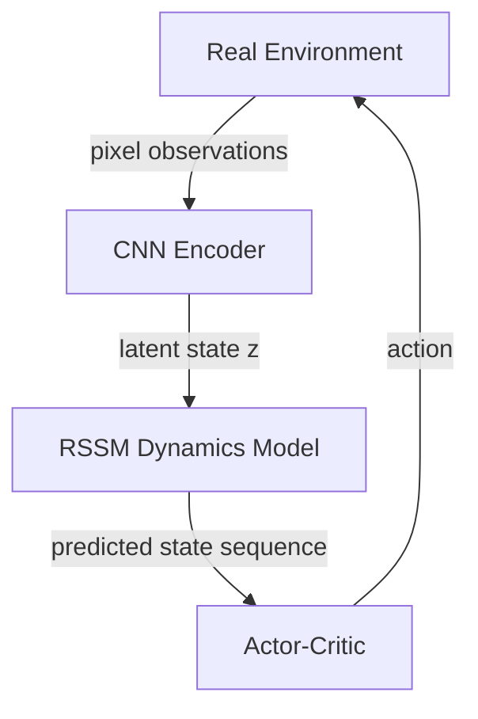

# Part B (Continued): Dreamer Series Architecture Iterations

## Transformer Dynamics: From GRU to Sequence Modeling

The core limitation of the GRU comes from its information bottleneck: all historical information must be compressed into a fixed-dimensional hidden state $\mathbf{h}_t$. The longer the sequence, the harder it becomes to retain early information, and long-range dependencies are easily lost. This is not a serious problem on short video game frames, but in tasks that require remembering events from dozens of steps ago to make correct decisions, the GRU's memory capacity becomes a hard constraint.

Transformer takes a different approach. Instead of summarizing history with a single hidden state, it performs attention directly over the entire history of latent states. Each step's prediction can "look back" at any historical state, with no information compression bottleneck. The trade-off is that computation grows with context length, and inference memory usage is higher. The full principles and formulas of the Transformer self-attention mechanism are covered in the Transformer architecture section of Lecture 03.

STORM (2023) replaced the GRU backbone in RSSM with a Transformer, achieving measurable gains in prediction accuracy and policy return on long-sequence Atari tasks. Dreamer V4 (2025) made the same replacement and combined it with offline policy learning, making long-horizon imagined trajectories more coherent and reliable. Lecture 03 will use RSSM as a baseline and compare these two backbone types side by side across different task constraints.

---

## Architecture Iterations of the Dreamer Series

RSSM is the foundational architecture established by Dreamer V1. The three subsequent versions evolved incrementally on top of it, with each iteration targeting a specific bottleneck of the previous version.

**[Dreamer V1 (2019)](https://arxiv.org/abs/1912.01603)** established the overall framework of RSSM plus latent space Actor-Critic, the structure described earlier in this lecture. It is the starting point for all subsequent versions.

**[Dreamer V2 (2020)](https://arxiv.org/abs/2010.02193)** replaced the continuous Gaussian $\mathbf{z}_t$ with a **discrete Categorical latent variable** (selecting from a finite set of categories rather than sampling from a continuous real-valued space), and used the **straight-through estimator** (a technique that lets gradients "pass through" a non-differentiable discrete sampling operation: the forward pass uses the discrete sample, while the backward pass treats the operation as an identity function so gradients flow through directly) to propagate gradients. Discrete latent variables produced two effects: training curves became notably more stable, and the semantic structure of the latent space became clearer. The dynamics backbone remained GRU, and the policy was still trained online.

**[Dreamer V3 (2023)](https://arxiv.org/abs/2301.04104)** changed the training recipe rather than the architecture. Two key techniques: **symlog transform** (symmetric log, applying symmetric logarithmic compression to reward values: $\text{symlog}(x) = \text{sign}(x) \cdot \ln(|x|+1)$, compressing rewards of vastly different magnitudes into a comparable numerical range to prevent extreme reward values from dominating gradients) compresses extreme reward values; **percentile normalization** (using the 5th and 95th percentiles of the reward distribution as scaling references rather than fixed min/max values, making normalization robust to outliers) decouples reward scaling from the choice of units. The result is that a single set of hyperparameters can be run directly on the full Atari suite, DMControl, and Minecraft without per-task tuning. Training an agent from scratch in Minecraft that can mine diamonds is the landmark result of this version, and it shows that the GRU backbone still has untapped potential given a sufficiently robust training recipe.

**[Dreamer V4 (2025)](https://arxiv.org/abs/2509.24527)** is a qualitative architectural change rather than a recipe adjustment. The dynamics core switches from GRU to **Transformer**, giving the world model the ability to model longer contexts and improving long-horizon prediction accuracy. The policy learning method also switches from online Actor-Critic to **offline policy learning** (the policy is trained entirely from pre-stored trajectory data without requiring real-time interaction with the environment; the distinction from "online" learning is that online learning updates while interacting, whereas offline learning uses only a fixed dataset): the policy is trained entirely from stored imagined trajectories, no longer relying on online rollouts. This design is architecturally very close in philosophy to STORM ([Zhang et al., 2023](https://arxiv.org/abs/2310.09615)) and IRIS ([Micheli et al., 2022](https://arxiv.org/abs/2209.00588)) introduced in Lecture 03. In a sense, Dreamer V4 represents the GRU camp's formal convergence toward the Transformer camp.

| Version | Dynamics Core | Latent Variable Type | Policy Learning | Key Advance |
|---------|--------------|---------------------|-----------------|-------------|
| V1 | GRU | Continuous Gaussian | Online Actor-Critic | RSSM architecture established |
| V2 | GRU | Discrete Categorical | Online Actor-Critic | Discrete latent variables, stable training |
| V3 | GRU | Discrete Categorical | Online Actor-Critic | Single hyperparameters across domains, Minecraft benchmark |
| V4 | Transformer | Discrete Categorical | Offline policy learning | Architectural shift, long-horizon reasoning |

<figure>

<figcaption>Ablation comparison from Hafner et al. (2019): pure deterministic path (no stochastic z_t), pure stochastic path (no deterministic h_t), and full RSSM. Results across six DMControl tasks consistently show that both paths are necessary, and the full RSSM outperforms all ablated variants on every task.</figcaption>
</figure>

---

## The Encoder's Role as a Bridge in Dreamer

The encoder is more than a compression tool. It is the **bridge** connecting the pixel world to the latent dynamics world:

The complete Dreamer pipeline:

1. **Encode**: $\mathbf{o}_t \xrightarrow{\text{encoder}} \mathbf{z}_t$
2. **Dynamics**: $(\mathbf{z}_t, \mathbf{a}_t) \xrightarrow{\text{RSSM}} \mathbf{z}_{t+1}, \mathbf{z}_{t+2}, \ldots$ (pure imagination)
3. **Policy learning**: train Actor-Critic on imagined trajectories, without interacting with the real environment
4. **Execution**: apply the policy to the real environment, collect a small number of new samples, and iterate

The quality of the encoder directly determines the upper bound of RSSM: the more semantically clear the latent space, the easier it is for the dynamics model to learn meaningful transition patterns.

---

## Summary

| Concept | Role | Key Equation / Structure |
|---------|------|--------------------------|
| VAE encoder | Compress pixels to $\mathbf{z}$ | ELBO = reconstruction loss - KL divergence |
| GRU dynamics | Deterministic prediction of next state | $\mathbf{z}_{t+1} = \text{GRU}(\mathbf{z}_t, \mathbf{a}_t)$ |
| MDN-RNN | Model multimodal uncertainty | Mixture-of-Gaussians output distribution |
| RSSM | Separate deterministic/stochastic state | $\mathbf{h}_t$ (memory) + $\mathbf{z}_t$ (perception) |
| Transformer dynamics | Global attention replacing fixed hidden state | $\mathbf{h}_t = \text{Attention}(\mathbf{z}_{1:t}, \mathbf{a}_{1:t-1})$ |
| Dreamer series | Stepwise evolution from V1 to V4 | GRU to Transformer, continuous to discrete latent, online to offline policy |

A good world model equals a good encoder (perceptual compression) plus a good dynamics model (temporal prediction). RSSM achieves an elegant balance between expressiveness and computational efficiency by separating the two types of state. The evolution across the four Dreamer versions shows that beyond the architecture itself, the type of latent variable and the training recipe are equally decisive factors.

---

## Next Lecture

The question for Lecture 03 is: RSSM is not the only option. How do Transformer-backbone world models (STORM, IRIS) perform on long-sequence tasks, and where does Dreamer V4 stand relative to them after switching to a Transformer?

After completing P01 and P02, you have a working RSSM baseline. Lecture 03 uses it as an anchor to compare six architecture families side by side, including Transformer dynamics, diffusion models, and JEPA, and explains where Dreamer V4 sits on that map. The comparison is not a ranking of better versus worse, but a map of where each architecture applies given different task constraints.

---

## Further Reading

- [Kingma & Welling (2014): Auto-Encoding Variational Bayes](https://arxiv.org/abs/1312.6114): the original VAE paper, ELBO derivation and the reparameterization trick
- [Ha & Schmidhuber (2018): World Models](https://arxiv.org/abs/1803.10122): MDN-RNN dynamics model and the dream-training framework
- [Hafner et al. (2019): PlaNet / RSSM](https://arxiv.org/abs/1811.04551): deterministic plus stochastic dual-path latent dynamics, first proposal of RSSM
- [Hafner et al. (2019): Dream to Control (Dreamer V1)](https://arxiv.org/abs/1912.01603): RSSM plus latent Actor-Critic, the original end-to-end Dreamer paper
- [Hafner et al. (2020): Mastering Atari with Discrete World Models (Dreamer V2)](https://arxiv.org/abs/2010.02193): discrete latent variables plus straight-through gradient estimator
- [Hafner et al. (2023): Mastering Diverse Domains with World Models (Dreamer V3)](https://arxiv.org/abs/2301.04104): unified hyperparameters across tasks, symlog transform for stable training
- [Hafner et al. (2025): Dreamer V4](https://arxiv.org/abs/2509.24527): Transformer backbone replacing GRU, offline data pretraining
