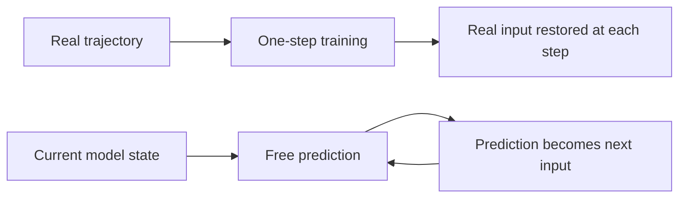

# Training Distributions and Free Rollouts

A model can predict the next frame accurately and still drift completely off course after ten generated steps. The one-step model may not be too weak. The problem may be that every training step begins from real data, while every step at deployment must begin from the model's own prediction.

This is the most important gap between predicting one step and supporting decisions. After this page, you should be able to distinguish teacher-forced and free rollouts, explain the distribution shift between RSSM posterior training and prior imagination, and decide how uncertainty should enter planning.

## One Model Faces Two Input Distributions

Autoregressive models often use **teacher forcing** during training. When predicting step $t+1$, the input comes from the ground-truth history in the dataset. The loss can be written as

$$
\mathcal{L}_{\mathrm{1step}}
=\mathbb{E}_{(x_t,a_t,x_{t+1})\sim\mathcal{D}}
\left[\ell\bigl(f_\theta(x_t,a_t),x_{t+1}\bigr)\right]
$$

During a free rollout, inputs come from the model itself after the first step. If the first prediction is $\hat{x}_{t+1}$, the next call is $f_\theta(\hat{x}_{t+1},a_{t+1})$, not the training-time call $f_\theta(x_{t+1},a_{t+1})$. A small error changes the next input, and that shifted input may produce a larger error.

The figure shows one model operating under two input distributions, not two separate models. Training metrics that cover only the upper path cannot guarantee stability in the lower closed loop.

## Posterior Training and Prior Imagination in an RSSM

An RSSM places the same problem in latent space. During training, the current observation constructs the posterior $q(z_t\mid h_t,o_t)$ and repeatedly pulls the latent state back toward a real trajectory. During imagination, future observations are unavailable. The model must sample from the prior $p(z_t\mid h_t)$ and feed the sample back into its transition model.

The KL loss between prior and posterior does more than make two distributions look alike. It narrows the gap between the training path and the usage path. If the prior matches the posterior for one step but drifts during repeated rollout, the agent will still learn its policy inside an unrealistic latent world.

## Why Errors Accumulate

Let $T$ be the real transition and $\hat{T}$ the learned transition. Even with bounded one-step error, the error after $H$ steps depends on the local approximation error, the sensitivity of the dynamics to perturbed inputs, and the model's tendency to visit states outside its training data. A rough expression is

$$
e_H \lesssim \sum_{k=0}^{H-1} L^k\epsilon
$$

$\epsilon$ is the one-step error, while $L$ describes whether the transition amplifies or contracts input perturbations. When $L>1$, a small $\epsilon$ can still produce rapid long-horizon growth. A one-step loss therefore cannot tell us how far the model can imagine reliably.

## A Planner Searches for Model Errors

An ordinary predictor passively receives inputs. A planner actively searches over action sequences. If the model mistakenly predicts a high reward in an unfamiliar region, CEM, MPC, or policy optimization may repeatedly choose actions that lead there. Errors are not amplified at random. The optimizer amplifies the errors that look most profitable.

Two kinds of uncertainty matter here:

| Type | Source | Can more data reduce it? | Decision-side response |
| --- | --- | --- | --- |
| Epistemic uncertainty | The model has not covered this state or dynamics | Usually | Ensemble disagreement, conservative penalty, active sampling |
| Aleatoric uncertainty | The environment is inherently stochastic | Usually not | Distributional prediction, risk-sensitive objective |

A broad predictive distribution is not the same as knowing whether the model is correct. A single stochastic model may express several possible futures while remaining overconfident outside its training distribution.

## Narrowing the Training-Usage Gap

No single technique removes the entire problem. Different methods act on different interfaces:

- **Free-rollout validation**: report errors at 1, 3, 5, and 10 steps instead of only one-step loss.
- **Multi-step objectives**: expose the model during training to some inputs produced by its own predictions.
- **Prior-posterior alignment**: inspect long-horizon latent drift in addition to KL.
- **Model ensembles**: use disagreement between members as an approximation to epistemic uncertainty.
- **Conservative planning**: subtract an uncertainty penalty from predicted return.
- **Receding-horizon replanning**: execute only the first MPC action, then refresh state estimation with a real observation.
- **Policy-aware data collection**: add states that the planner actually visits back into the training data.

## Consequences for P02 and the Next Lecture

P02 should not compare GRU, MDN-RNN, and RSSM using one-step error alone. Inspect both teacher-forced predictions and free rollouts, then plot error against horizon. When two models have similar one-step scores, the horizon curve often explains which one is suitable for planning.

The next lecture hands predictions to CEM-MPC, latent Actor-Critic, and TD-MPC. Carry one judgment into planning: **planning quality depends not only on average model accuracy, but also on where the model fails, whether it knows it may be wrong, and how soon real feedback can correct it.**

## Check Your Understanding

1. Why does a low teacher-forced one-step loss fail to establish reliable free rollouts?
2. Why can the RSSM posterior not be used directly for future imagination?
3. If a planner repeatedly selects actions that are rare in the training data, what two kinds of evidence would distinguish genuine high reward from model exploitation?
