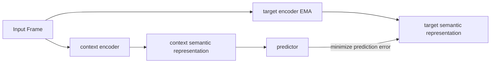

# Part C, Optional Frontier Survey: JEPA and RWM

This page is optional for the build path. It broadens the comparison beyond the backbones implemented in P03 and P04: JEPA asks what should be predicted, while RWM asks how prediction can remain dependable during robot deployment.

## Architecture Four: JEPA (2023, Non-Generative)

**Representative systems**: I-JEPA (2023), V-JEPA (2024), V-JEPA 2 (2025), led by Yann LeCun ([LeCun, 2022](https://openreview.net/forum?id=BZ5a1r-kVsf))

### Core Mechanism

The central idea of JEPA (Joint Embedding Predictive Architecture) is: **do not predict pixels; predict in semantic latent space**.

Given the current observation $x$, an encoder maps it to a semantic representation $s_x$; a predictor uses context to predict the representation $s_y$ of a target region, rather than reconstructing the pixels $y$:

$$\hat{s}_y = f_\theta(s_x,\, \text{context})$$

Pixel space is saturated with task-irrelevant information: lighting variation, texture detail, shadow direction, sensor noise. A pixel-level reconstruction model must spend model capacity learning "what color this patch of skin should be at this lighting angle," which contributes nothing to understanding "whether this hand is gripping the cup." A more fundamental issue is that mean squared error causes models to output blurry "average images," and while GANs can produce sharp images, they introduce training instability. JEPA's answer is: **never enter pixel space; predict directly at the semantic level**.

### The context encoder + predictor + target encoder trio

The training objective is to minimize the L2 distance between the predictor output and the target representation:

$$\mathcal{L}_{\text{JEPA}} = \|\text{predictor}(s_x) - s_y\|^2$$

> **📖 stop-gradient and EMA**: `stop_gradient(s_y)` means the computation of $s_y$ does not participate in backpropagation; gradients are cut off here. The EMA update rule is $\xi \leftarrow \tau \xi + (1-\tau) \theta$, where $\tau \approx 0.996$, causing the target encoder to "follow" the context encoder at an extremely slow pace. Without this constraint, the model may find that "mapping all inputs to the same vector" is a shortcut to minimizing the loss (known as **representation collapse**). The EMA + stop-gradient combination breaks the symmetry that produces collapse by making the two encoders update asynchronously.

When Meta released V-JEPA 2 in 2025, it was explicitly positioned as a "**world model component toward AGI**," not a video generator. Given an action sequence, V-JEPA 2 predicts future visual representations in semantic space. The goal is not to generate realistic video but to understand "if I move my arm this way, where will the object be."

**Learning paradigm**: primarily observation-based. Training data consists of video sequences with no action labels required. JEPA does not compete in "who can generate more realistic video"; its objective is "who can better understand the physical world."

**Applicable scenarios**: visual representation pretraining, semantic similarity tasks, data-efficient downstream classification and retrieval; expected to become a foundation for general-purpose world models.

**Limitations**: produces no visualizable output; evaluation metrics are non-intuitive; using JEPA representations for MPC or actor-critic remains an open problem.

## Architecture Five: Robotic World Model (RWM), the Hard Problem of Robot Control

**Representative systems**: Self-Forcing (NeurIPS 2025), RWM-U (ICLR 2026, ETH Zurich), DreamDojo (NVIDIA, 2025)

The primary battleground for the first four architecture families is "generation quality" or "game intelligence." Robot control presents a harder class of problems where the core challenge is not "can we generate realistic images" but "can we train a policy that is actually deployable in the real world."

### Two Core Problems

**Problem one: long-horizon rollout divergence**

During training, the model receives the **true state** as input at each step (teacher forcing); during inference, the model must take **its own predictions** as input (autoregressive rollout), causing errors to accumulate and trajectories to rapidly deviate from reality. This distribution gap between training and inference causes long-horizon rollouts to produce physically impossible states.

**Problem two: policy exploitation**

The policy actively searches for and exploits model errors, discovering action sequences that produce spuriously high rewards inside the world model but are meaningless or even harmful in the real environment.

**[Self-Forcing](https://arxiv.org/abs/2506.08009)** (NeurIPS 2025) addresses this by "simulating" inference-time error accumulation during training: instead of always feeding the model true states, it sometimes feeds the model its own previous predictions, and computes the loss against true states across **multiple steps** simultaneously. This is a systematic version of **scheduled sampling** (a training technique where true historical frames are used with high probability early in training, and the probability of using the model's own predicted frames is gradually increased as training progresses, causing the model to progressively adapt to the autoregressive pattern at inference time). Validated in the diffusion world model setting, Self-Forcing reduces the cumulative error of 50-step rollouts to approximately one-third of that produced by teacher forcing.

**[RWM-U](https://arxiv.org/abs/2504.16680)** (Uncertainty-Aware Robotic World Model, ICLR 2026, ETH Zurich, Krause, Hutter) is designed specifically for **offline MBRL** (Offline Model-Based RL): it does not rely on online environment interaction, instead learning a world model solely from a fixed historical dataset and then training a policy entirely inside the world model. This purely offline setting is especially valuable for real robots, where online interaction is costly and poses safety risks.

The core mechanism of RWM-U is **ensemble uncertainty estimation** (training multiple independent models simultaneously and using the degree of disagreement among their predictions to quantify uncertainty: high agreement indicates sufficient data coverage in a region, while high disagreement indicates sparse data). Specifically, $N$ independently initialized autoregressive world models are trained simultaneously, their **ensemble variance** (the statistical variance of multiple models' predictions on the same input) is used to quantify epistemic uncertainty, and this uncertainty is propagated consistently across the entire rollout trajectory. Policy optimization penalizes high-uncertainty regions, using **PPO** (Proximal Policy Optimization, an on-policy gradient algorithm that maintains training stability by constraining the magnitude of each parameter update) rather than off-policy algorithms for greater stability:

$$\text{policy reward} = \text{task reward} - \lambda \times \text{uncertainty}$$

By penalizing high-uncertainty regions, the policy is guided to remain within the state distribution where the model is reliable. The authors validated the framework on manipulation and locomotion tasks for quadruped and humanoid robots; policy performance consistently surpassed uncertainty-unaware baselines, and supplementing the offline dataset with a small amount of real robot data yielded further improvements over purely simulated online baselines.

> **📖 Epistemic uncertainty**: uncertainty arising from the model having seen insufficient data. In regions with adequate training data coverage, multiple independent models produce similar predictions (low variance); in regions with sparse training data, the models produce divergent predictions (high variance). This differs from aleatoric uncertainty, which stems from randomness inherent in the environment itself. Epistemic uncertainty can be reduced with more data; aleatoric uncertainty cannot.

**[DreamDojo](https://arxiv.org/abs/2602.06949)** (NVIDIA et al., 2025) addresses data scarcity from a different angle: it learns directly from **large-scale human first-person video**, which requires no action annotation whatsoever.

<figure>

<figcaption>Information bottleneck design of LAM: the encoder receives adjacent frame pairs (f^t, f^{t+1}) and compresses inter-frame change into a low-dimensional continuous vector â_t (the latent action); the decoder reconstructs f^{t+1} conditioned on â_t and f^t. When human hands and robotic arms perform the same type of action in different scenes, LAM produces highly similar latent vectors, enabling cross-embodiment transfer.</figcaption>
</figure>

The core technology is **LAM** (Latent Action Model), which uses a VAE architecture to self-supervisedly extract **continuous latent actions** $\hat{a}_t$ from consecutive frame pairs $(f^t, f^{t+1})$. The information bottleneck filters out irrelevant variables such as lighting and texture, retaining only "what type of action occurred between frames." During pretraining, future frames are predicted conditioned on $\hat{a}_t$; during post-training, a small amount of annotated robot data aligns the latent actions to the real control space. A teacher model is compressed via two-stage distillation into a causal-attention student, achieving inference speed sufficient for real-time teleoperation.

**Learning paradigm**: observation-based pretraining (human video, no action annotation) followed by post-training on a small amount of target data.

**Applicable scenarios**: high-frequency robot control, scenarios where offline data is plentiful but online interaction is costly.
