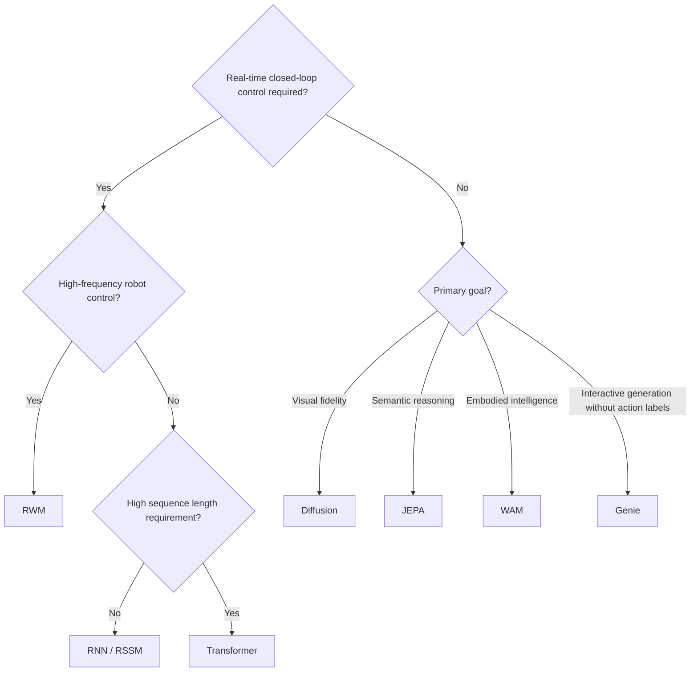

# Part A (cont. 2): Genie, WAM, and Architecture Selection

## Genie: Discovering Actions Implicitly from Video

**Representative systems**: Genie (Google DeepMind, 2024), Genie 2 (2024)

The first five architecture families share a common assumption: training data either includes action labels (interactive) or requires no actions at all (observation-only). Genie breaks this dichotomy by **automatically discovering implicit latent actions from unannotated internet video**.

Training data consists of large collections of video clips showing humans playing games and manipulating objects, with no action labels of any kind. Genie jointly trains three modules: a video tokenizer (**ST-ViT**, Spatiotemporal Vision Transformer, which applies patch-based encoding simultaneously along both the spatial and temporal dimensions to produce spatiotemporal discrete tokens) that compresses frame sequences into spatiotemporal discrete tokens; a latent action model (**LAM**, which learns to infer the type of change between adjacent frames) that infers discrete latent action codes from consecutive frame pairs; and a dynamics model that predicts the next frame token sequence conditioned on the latent action. At inference time, a user can specify a latent action and the model generates the next frame accordingly, making the entire process fully interactive.

> **📖 latent action**: Not a keyboard input like "move left" or a joint-space torque, but a discrete code derived purely from differences between video frames. It captures "what type of change occurred between adjacent frames," not a concrete physical action. Two video clips with similar scene-transition patterns (such as "an object moving to the right") should share the same latent action code, regardless of whether the footage shows a game or a robot manipulation task.

<figure>

<figcaption>Bruce et al. (2024) Genie's three-module design: ST-ViT encodes video frame sequences into spatiotemporal discrete tokens; LAM infers discrete latent action codes from consecutive frame pairs (no action annotations required); the dynamics model is conditioned on the latent action and uses MaskGIT to autoregressively predict the next frame token sequence.</figcaption>
</figure>

Genie was trained on 30,000 hours of platformer game video (no action annotations) with 11B parameters. The paper measures generation quality degradation using $\Delta_t\text{PSNR}$ (the drop in PSNR at inference time relative to a teacher forcing baseline) as a proxy for latent action alignment. Genie's significance lies in bypassing the "action annotation" bottleneck: the internet contains vast quantities of video, but almost none of it comes with paired robot action labels. Genie 2 extends the approach to 3D scenes, generating fully interactive 3D worlds from a single input image. Bi et al. released [Motus](https://arxiv.org/abs/2512.13030) (A Unified Latent Action World Model) in 2025, validating a similar idea on embodied manipulation tasks: a unified latent action representation extracts action knowledge from heterogeneous video data, with a small amount of labeled data used to align it to real control signals, enabling cross-embodiment transfer.

**Learning paradigm**: sits between observation-only and interactive. Training uses only video (observation-only), but inference supports action-conditioned generation (interactive). This idea directly inspired the subsequent WAM family.

**Limitations**: latent actions are induced automatically and are not aligned with real physical actions, so they cannot be used directly for robot control. An additional alignment step is still required to go from latent actions to a real policy.

---

## Architecture Six: From World Model to World Action Model (WAM)

**Representative systems**: Motus (2025, Bi et al.), DreamZero / WAM (NVIDIA 2026)

Genie demonstrated that discovering action representations implicitly from video is feasible. The WAM family picks up this idea and pushes further: do the world model and the policy model actually need to be two separate modules?

| Paradigm | Input | Output |
|----------|-------|--------|
| World Model | observation + action | future observation or state |
| VLA (Vision-Language-Action model) | observation + language instruction | action |
| WAM | observation + language instruction | future observation + action |

The traditional World Model takes actions as input and predicts future states, functioning as a simulator sitting alongside the policy. VLA bypasses the world model entirely, predicting actions directly from visual observations and language instructions as an end-to-end reactive policy. WAM attempts to do both simultaneously: predict the future state of the world while also predicting the action to take. The visual evolution of the world becomes **dense supervision** for action learning (as opposed to sparse supervision where a reward is given only at the end of an episode; here every frame of video provides gradient signal, making the learning signal richer and more frequent) rather than merely an auxiliary task.

**[Motus](https://arxiv.org/abs/2512.13030)** (Bi et al., 2025) introduces a unified **latent action** representation: continuous latent actions are automatically extracted from heterogeneous video data (including large quantities of unannotated human video and robot demonstrations), then aligned to real robot control using a small amount of labeled data. The core contribution of Motus is integrating "discovering latent actions from unannotated video" and "transferring to real control via a small alignment dataset" into a single unified framework, with cross-embodiment transfer validated on dexterous manipulation and locomotion tasks.

**DreamZero / WAM** (NVIDIA 2026) uses a pretrained **video generation backbone** to simultaneously predict future world states and robot actions, treating video sequences as dense supervision. NVIDIA's WAM (World Action Models) paper explicitly proposes "WAM as a zero-shot policy": a pretrained video generation model can serve directly as a policy inference engine without additional RL fine-tuning:

| Paradigm | Supervision signal | Loss |
|----------|--------------------|------|
| VLA | observation sequence → action sequence | action loss only |
| WAM | observation sequence → future frame sequence + action sequence | video reconstruction loss + action loss, mutually reinforcing |

**Learning paradigm**: the fourth paradigm, joint learning. Video and actions are two facets of the same physical process. WAM leverages the dense physical supervision from video to let the policy learn about physical motion and action consequences, rather than performing action regression alone.

**Emerging trend revealed by this line of work**: the world model is no longer just a simulator sitting beside the policy; it is becoming part of the policy itself. In the traditional model-based RL framework, the world model and the policy are two separate modules. The WAM family is dismantling this separation by training a **unified model** that jointly captures world dynamics and decision logic. [Cosmos](https://arxiv.org/abs/2501.03575) (NVIDIA 2025) goes further still: as a general-purpose physical AI foundation model, it is pretrained on massive real-world video and then fine-tuned for downstream tasks such as autonomous driving and robotics, pushing the concept of a world model from "single-task simulator" toward "general-purpose physical world infrastructure."

---

## Comparative Summary Table

| Architecture Family | Learning Paradigm | Core Strengths | Main Weaknesses | Typical Use Cases |
|---------------------|-------------------|----------------|-----------------|-------------------|
| **RNN / RSSM** | Interactive | Low compute, low latency | Weak long-term memory, limited generation quality | Online RL, real-time control |
| **Transformer** | Interactive/Observation | Strong long-range dependencies, fast parallel training | Compute scales quadratically with sequence length | Complex games, multi-step planning |
| **Diffusion** | Observation/Interactive | Very high visual fidelity | Slow inference, difficult to use for real-time control | Offline simulation, video generation |
| **JEPA** | Observation-only | Robust and efficient, ignores irrelevant noise | No pixel output, control applications not yet mature | Semantic representation pretraining |
| **RWM** | Interactive | Stable long-horizon rollout, policy does not drift | High compute (ensemble) | High-frequency robot control, sim-to-real |
| **Genie** | Observation → Interactive | Supports interactive generation without action labels | latent actions not aligned with real actions | Interactive video generation, data pretraining |
| **WAM** | Joint learning | World prediction and action planning jointly optimized | Complex architecture, high data requirements | Embodied intelligence, dexterous manipulation |

## How to Choose an Architecture?

**Practical advice**: start with RNN/RSSM; P02 already walks you through this step. Upgrade only when you hit a bottleneck: if long-sequence prediction accuracy keeps declining, or the task requires causal reasoning across many steps, consider switching to Transformer. Reserve Diffusion for offline scenarios. The JEPA control interface is not yet mature, but representation learning tasks have produced substantive results and are worth tracking. When you have large amounts of unannotated video but lack action labels, Genie's latent action discovery mechanism is currently the most direct entry point, though an alignment step is still needed for real control. For real robotics, engineering techniques such as Self-Forcing and ensemble uncertainty are more impactful than switching architectures; solve long-horizon stability first.
