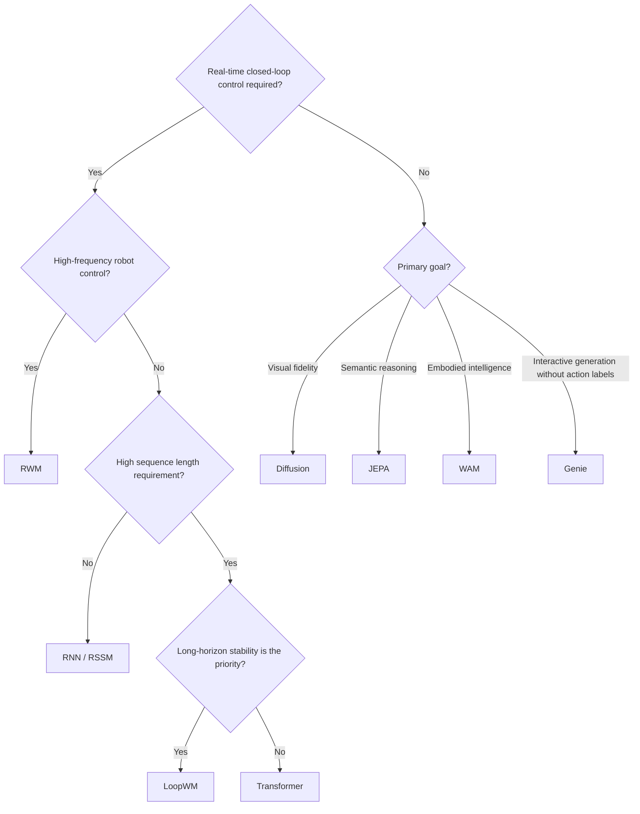

# Part C (Continued), Optional: LoopWM, WAM, and Architecture Selection

## Architecture Seven: Looped Dynamics Models (LoopWM)

**Representative systems**: LoopWM (Looped World Models, [Lu et al., 2026](https://www.emergentmind.com/papers/2606.18208))

The architecture families above mostly share an implicit assumption about the dynamics predictor's depth: longer-horizon, higher-fidelity simulation requires a deeper network, and a deeper network means more parameters, higher inference cost, and a greater tendency to accumulate error over long rollouts. LoopWM breaks the assumption that "depth equals parameter count": an encoder $E_\phi$ compresses the observation $o_k$ into $e_k$, an action embedder $A_\psi$ compresses the action $a_k$ into $u_k$, and both feed the **Looped Dynamics Core** $L_\theta$. Inside this core, a Prelude $P$ first conditions on $(h_{k-1}, e_k, u_k)$; a parameter-shared Recurrent Block $R$ then loops $T$ times to refine the hidden state, $h^{(t)} = \bar{A} h^{(t-1)} + \bar{B} e + \text{Transformer residual}$; and a Coda $C$ finalizes $h_k$, which becomes the next step's initial state. Here $\bar{A} = \exp(\Delta \, \text{diag}(-\exp(a)))$, which keeps every eigenvalue in $(0, 1)$. This **spectral stabilization** constraint makes every loop a contractive mapping, so the rollout does not diverge no matter how many times $T$ it loops. $h_k$ is finally passed through prediction heads $D_\xi$ to produce the next observation, reward, and termination signal $(\hat{o}_{k+1}, \hat{r}_{k+1}, d_{k+1})$.

<figure>

<figcaption>Lu et al. (2026) LoopWM's full architecture: the observation and action are each compressed by an encoder $E_o$ and action embedder $A_a$ before entering the Looped Dynamics Core. Inside the core, a Prelude produces a condition, a shared Recurrent Block loops $T$ times (with an exit gate $g^{(t)}$ deciding whether to halt early), and a Coda projects the result to $h_k$; the spectral stability guarantee $\rho(\bar{A}) < 1$ makes every loop a contractive mapping. $h_k$ is fed to prediction heads that output the next observation, reward, and termination signal, or unrolled across several steps along the deferred-decoding path, decoding only at the terminal step.</figcaption>
</figure>

Alongside spectral stabilization, LoopWM defers decoding to the final step of a rollout sequence (deferred decoding, which lowers compute cost and produces a latent structure better suited to long-horizon planning), and uses a learned exit gate for adaptive computation: the loop halts early once the gate signal crosses a threshold $\tau$, so easy transitions get fewer iterations while hard ones (such as collisions) get more. During training, the loop count $T$ is sampled from a Poisson distribution $\text{Poisson}(\mu_{\text{rec}})$ combined with truncated BPTT, so the model supports variable-depth inference at test time. On ScienceWorld and AlfWorld, a roughly 1B-parameter LoopWM outperforms closed-source baselines 100x larger on several metrics while remaining stable on long-horizon tasks, and prediction quality keeps improving with more loop iterations, positioning iterative latent depth as a third scaling axis orthogonal to model size and data volume.

**Learning paradigm**: interactive, an action-conditioned latent dynamics predictor that can directly replace an RSSM or standard Transformer dynamics model as the backbone.

**Limitations**: the spectral stabilization constraint only applies to the linear retention term in the update rule; the nonlinear residual term has no equivalent stability guarantee. The paper is validated mainly on text-based interactive environments and has not yet been thoroughly validated on pixel-level continuous control or real robots.

## Architecture Eight: From World Model to World Action Model (WAM)

**Representative systems**: Motus (2025, Bi et al.), DreamZero / WAM (NVIDIA 2026)

Genie demonstrated that discovering action representations implicitly from video is feasible. The WAM family picks up this idea and pushes further: do the world model and the policy model actually need to be two separate modules?

| Paradigm | Input | Output |
|----------|-------|--------|
| World Model | observation + action | future observation or state |
| VLA (Vision-Language-Action model) | observation + language instruction | action |
| WAM | observation + language instruction | future observation + action |

The traditional World Model takes actions as input and predicts future states, functioning as a simulator sitting alongside the policy. VLA bypasses the world model entirely, predicting actions directly from visual observations and language instructions as an end-to-end reactive policy. WAM attempts to do both simultaneously: predict the future state of the world while also predicting the action to take. The visual evolution of the world becomes **dense supervision** for action learning (as opposed to sparse supervision where a reward is given only at the end of an episode; here every frame of video provides gradient signal, making the learning signal richer and more frequent) rather than merely an auxiliary task.

**[Motus](https://arxiv.org/abs/2512.13030)** (Bi et al., 2025) introduces a unified **latent action** representation: continuous latent actions are automatically extracted from heterogeneous video data (including large quantities of unannotated human video and robot demonstrations), then aligned to real robot control using a small amount of labeled data. The core contribution of Motus is integrating "discovering latent actions from unannotated video" and "transferring to real control via a small alignment dataset" into a single unified framework, with cross-embodiment transfer validated on dexterous manipulation and locomotion tasks.

**DreamZero / WAM** (NVIDIA 2026) uses a pretrained **video generation backbone** to simultaneously predict future world states and robot actions, treating video sequences as dense supervision. NVIDIA's WAM (World Action Models) paper explicitly proposes "WAM as a zero-shot policy": a pretrained video generation model can serve directly as a policy inference engine without additional RL fine-tuning:

| Paradigm | Supervision signal | Loss |
|----------|--------------------|------|
| VLA | observation sequence as input; action sequence as output | action loss only |
| WAM | observation sequence as input; future frames and actions as outputs | video reconstruction loss + action loss, mutually reinforcing |

**Learning paradigm**: the fourth paradigm, joint learning. Video and actions are two facets of the same physical process. WAM leverages the dense physical supervision from video to let the policy learn about physical motion and action consequences, rather than performing action regression alone.

**Emerging trend revealed by this line of work**: the world model is no longer just a simulator sitting beside the policy; it is becoming part of the policy itself. In the traditional model-based RL framework, the world model and the policy are two separate modules. The WAM family is dismantling this separation by training a **unified model** that jointly captures world dynamics and decision logic. [Cosmos](https://arxiv.org/abs/2501.03575) (NVIDIA 2025) goes further still: as a general-purpose physical AI foundation model, it is pretrained on massive real-world video and then fine-tuned for downstream tasks such as autonomous driving and robotics, pushing the concept of a world model from "single-task simulator" toward "general-purpose physical world infrastructure."

## Comparative Summary Table

| Architecture Family | Learning Paradigm | Core Strengths | Main Weaknesses | Typical Use Cases |
|---------------------|-------------------|----------------|-----------------|-------------------|
| **RNN / RSSM** | Interactive | Low compute, low latency | Weak long-term memory, limited generation quality | Online RL, real-time control |
| **Transformer** | Interactive/Observation | Strong long-range dependencies, fast parallel training | Compute scales quadratically with sequence length | Complex games, multi-step planning |
| **Diffusion** | Observation/Interactive | Very high visual fidelity | Slow inference, difficult to use for real-time control | Offline simulation, video generation |
| **JEPA** | Observation-only | Robust and efficient, ignores irrelevant noise | No pixel output, control applications not yet mature | Semantic representation pretraining |
| **RWM** | Interactive | Stable long-horizon rollout, policy does not drift | High compute (ensemble) | High-frequency robot control, sim-to-real |
| **Genie** | Observation-trained, interactive at inference | Supports interactive generation without action labels | latent actions not aligned with real actions | Interactive video generation, data pretraining |
| **LoopWM** | Interactive | Parameter-efficient, provably stable long-horizon rollout | No stability guarantee on the nonlinear term, not yet validated on pixels/real robots | Long-horizon planning, resource-constrained deployment |
| **WAM** | Joint learning | World prediction and action planning jointly optimized | Complex architecture, high data requirements | Embodied intelligence, dexterous manipulation |

## How to Choose an Architecture?

**Practical advice**: start with RNN/RSSM; P02 already walks you through this step. Upgrade only when you hit a bottleneck: if long-sequence prediction accuracy keeps declining, or the task requires causal reasoning across many steps, consider switching to Transformer; if the bottleneck is specifically diverging error accumulation over long rollouts, LoopWM's spectral stabilization offers a more parameter-efficient path. Reserve Diffusion for offline scenarios. The JEPA control interface is not yet mature, but representation learning tasks have produced substantive results and are worth tracking. When you have large amounts of unannotated video but lack action labels, Genie's latent action discovery mechanism is currently the most direct entry point, though an alignment step is still needed for real control. For real robotics, engineering techniques such as Self-Forcing and ensemble uncertainty are more impactful than switching architectures; solve long-horizon stability first.
