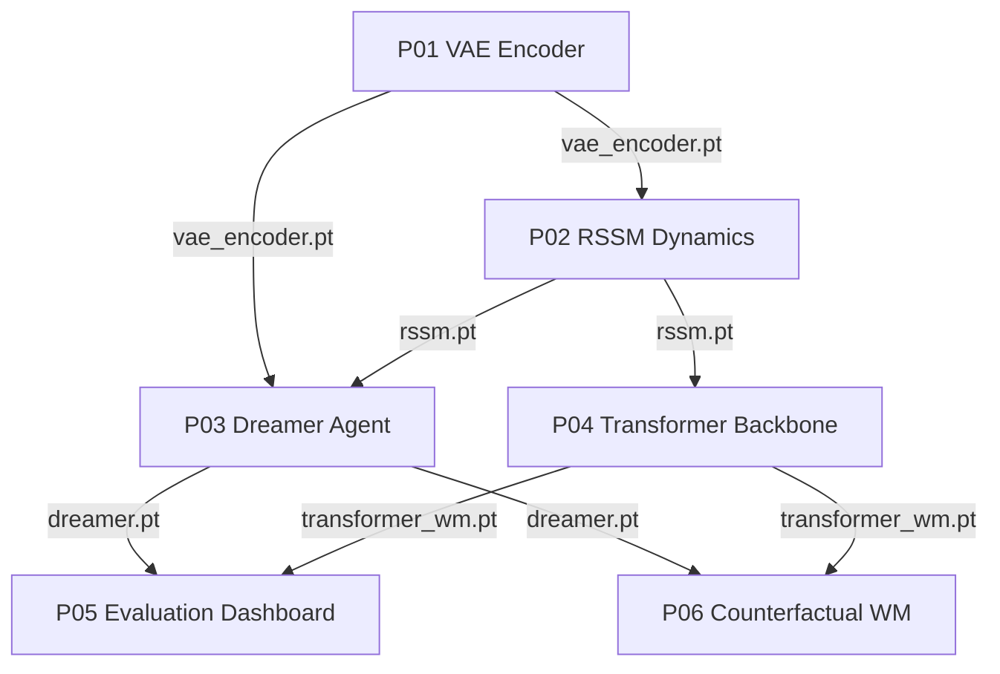

# Projects

Six hands-on projects build a complete world-model pipeline from scratch. Work through them in order: the encoder from P01 becomes the observation encoder in P02, the dynamics model from P02 becomes the backbone in P03 and the baseline in P04, the two trained systems from P03 and P04 are compared in P05, and P06 probes those same systems for causal fidelity. Each project is a notebook-first tutorial that runs on CPU, GPU, or TPU, uses only synthetic data, and passes a checkpoint to the next stage.

## Hardware requirements

Every notebook in this section was developed and run on Google Colab with a single T4 GPU (16 GB). Any accelerator with comparable or greater memory and compute, whether an Nvidia GPU, an AMD GPU, or a TPU from the same or a later generation, runs all six projects unchanged. A single mid-range consumer GPU is enough. None of the projects require multi-GPU training.

If you do not already have access to a machine with a suitable GPU, here are cloud options that work well:

| Provider | Hardware | Good for | Link |
|---|---|---|---|
| Google Colab | T4, L4, A100 | The reference environment for this course. Free tier works for smoke tests, Pro gives reliable T4/L4 access | [colab.research.google.com/signup](https://colab.research.google.com/signup) |
| Kaggle Notebooks | T4 x2, P100 | Free 30 GPU-hours per week, no subscription needed | [kaggle.com/docs/notebooks](https://www.kaggle.com/docs/notebooks) |
| AMD Developer Cloud | MI300X | Free trial credits for testing ROCm compatibility on AMD GPUs | [amd.com/en/developer/resources/cloud-access.html](https://www.amd.com/en/developer/resources/cloud-access.html) |
| Lambda Cloud | A10, A100, H100 | On-demand Nvidia instances billed by the hour, no long-term commitment | [lambda.ai/service/gpu-cloud](https://lambda.ai/service/gpu-cloud) |
| RunPod | Wide range of GPUs, community and secure cloud tiers | Cheap on-demand and spot pricing for short training runs | [runpod.io](https://www.runpod.io/) |
| Google Cloud TPU | TPU v4/v5e | Validating the TPU code path specifically | [cloud.google.com/tpu](https://cloud.google.com/tpu) |

All of the providers above have been verified to run these notebooks without changes. The code only uses standard PyTorch operations with no CUDA-specific calls, so it also runs unmodified under ROCm on AMD hardware.

Markdown pages only include narrative text and code. Outputs, plots, tables, and other artifacts live in the corresponding `.ipynb` notebook files.

Open any notebook in Jupyter or Colab and run it top to bottom. If an upstream checkpoint is missing, the notebook falls back to random initialization so it still works as a smoke test, but the cross-project comparisons only become meaningful once the real checkpoints are in place.

## Project sequence

| # | Project | Prerequisite | Saves | Deliverable |
|---|---------|--------------|-------|-------------|
| P01 | [Train a VAE Encoder](./p01_vae_encoder) | L02 Part A | `vae_encoder.pt` | CNN VAE on 64×64 frames. ELBO loss curve. Latent traversals showing disentangled dimensions |
| P02 | [Build an RSSM Dynamics Model](./p02_rssm_dynamics) | P01, L02 Part B | `rssm.pt` | GRU, MDN-RNN, and RSSM compared. Rollout plots. 1-step to 5-step prediction error curves |
| P03 | [Train a Dreamer Agent](./p03_dreamer_agent) | P02, L03 Part A | `dreamer.pt` | Encoder + RSSM + latent Actor-Critic training loop. Reward curve. FID and reward-correlation self-evaluation |
| P04 | [Swap the Dynamics Backbone](./p04_transformer_backbone) | P03, L03 Part B | `transformer_wm.pt` | RSSM replaced by a STORM-style categorical VAE plus causal Transformer. Architecture comparison report |
| P05 | [World Model Evaluation Dashboard](./p05_evaluation_dashboard) | P03, P04, L04 | -- | Both trained models loaded and scored side by side: PSNR, reward correlation, token loss, and latent drift |
| P06 | [Counterfactual Action-Conditioned World Model](./p06_counterfactual_world_model) | P03, P04 | `causal_wm.pt` | Pearl-ladder analysis: interventional and counterfactual rollouts, an inverse-dynamics-regularized world model, and an action-influence metric |

## How the checkpoints chain together

The projects share a single set of weight files passed forward through the pipeline. P01 trains the VAE and writes `vae_encoder.pt`. P02 loads that encoder, trains the dynamics models, and writes `rssm.pt`. From there the path forks: P03 combines the encoder and RSSM into a Dreamer agent saved as `dreamer.pt`, while P04 reuses the RSSM as a baseline and trains a Transformer backbone saved as `transformer_wm.pt`. P05 loads both `dreamer.pt` and `transformer_wm.pt` for the accuracy evaluation. P06 then loads the same two checkpoints to probe causal fidelity, training its own action-regularized model saved as `causal_wm.pt`.

