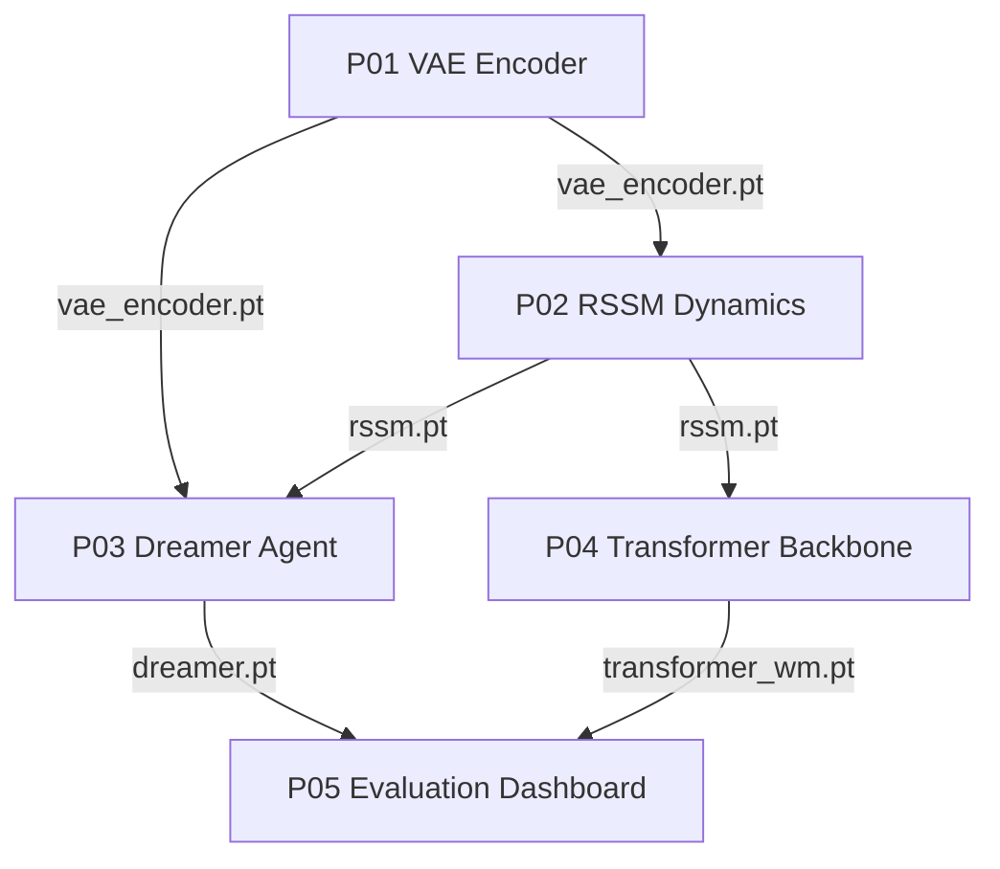

# Projects

Five hands-on projects build a complete world-model pipeline from scratch. Work through them in order: the encoder from P01 becomes the observation encoder in P02, the dynamics model from P02 becomes the backbone in P03 and the baseline in P04, and the two trained systems from P03 and P04 are compared in P05. Each project is a notebook-first tutorial that runs on CPU, GPU, or TPU, uses only synthetic data, and passes a checkpoint to the next stage.

Markdown pages only include narrative text and code. Any outputs, plots, tables, or other artifacts live in the corresponding `.ipynb` notebook files.

Open any notebook in Jupyter or Colab and run it top to bottom. If an upstream checkpoint is missing, the notebook falls back to random initialization so it still works as a smoke test, but the cross-project comparisons only become meaningful once the real checkpoints are present.

## Project sequence

| # | Project | Prerequisite | Saves | Deliverable |
|---|---------|--------------|-------|-------------|
| P01 | [Train a VAE Encoder](./p01_vae_encoder) | L02 Part A | `vae_encoder.pt` | CNN VAE on 64×64 frames; ELBO loss curve; latent traversals showing disentangled dimensions |
| P02 | [Build an RSSM Dynamics Model](./p02_rssm_dynamics) | P01, L02 Part B | `rssm.pt` | GRU, MDN-RNN, and RSSM compared; rollout plots; 1-step to 5-step prediction error curves |
| P03 | [Train a Dreamer Agent](./p03_dreamer_agent) | P02, L03 Part B | `dreamer.pt` | Encoder + RSSM + latent Actor-Critic training loop; reward curve; FID and reward-correlation self-evaluation |
| P04 | [Swap the Dynamics Backbone](./p04_transformer_backbone) | P02, L03 Part A | `transformer_wm.pt` | RSSM replaced by a STORM-style categorical VAE plus causal Transformer; architecture comparison report |
| P05 | [World Model Evaluation Dashboard](./p05_evaluation_dashboard) | P03, P04, L04 | -- | Both trained models loaded and scored side by side: PSNR, reward correlation, token loss, and latent drift |

## How the checkpoints chain together

The projects share a single set of weight files passed forward through the pipeline. P01 trains the VAE and writes `vae_encoder.pt`. P02 loads that encoder, trains the dynamics models, and writes `rssm.pt`. From there the path forks: P03 combines the encoder and RSSM into a Dreamer agent saved as `dreamer.pt`, while P04 reuses the RSSM as a baseline and trains a Transformer backbone saved as `transformer_wm.pt`. P05 closes the loop by loading both `dreamer.pt` and `transformer_wm.pt` for the final evaluation.

