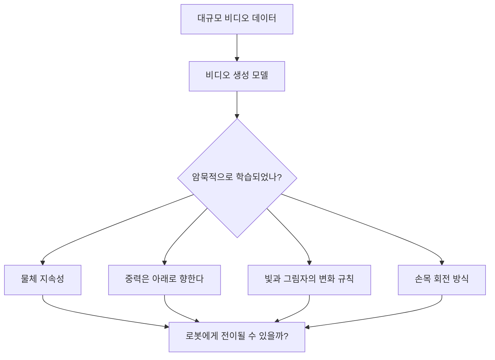
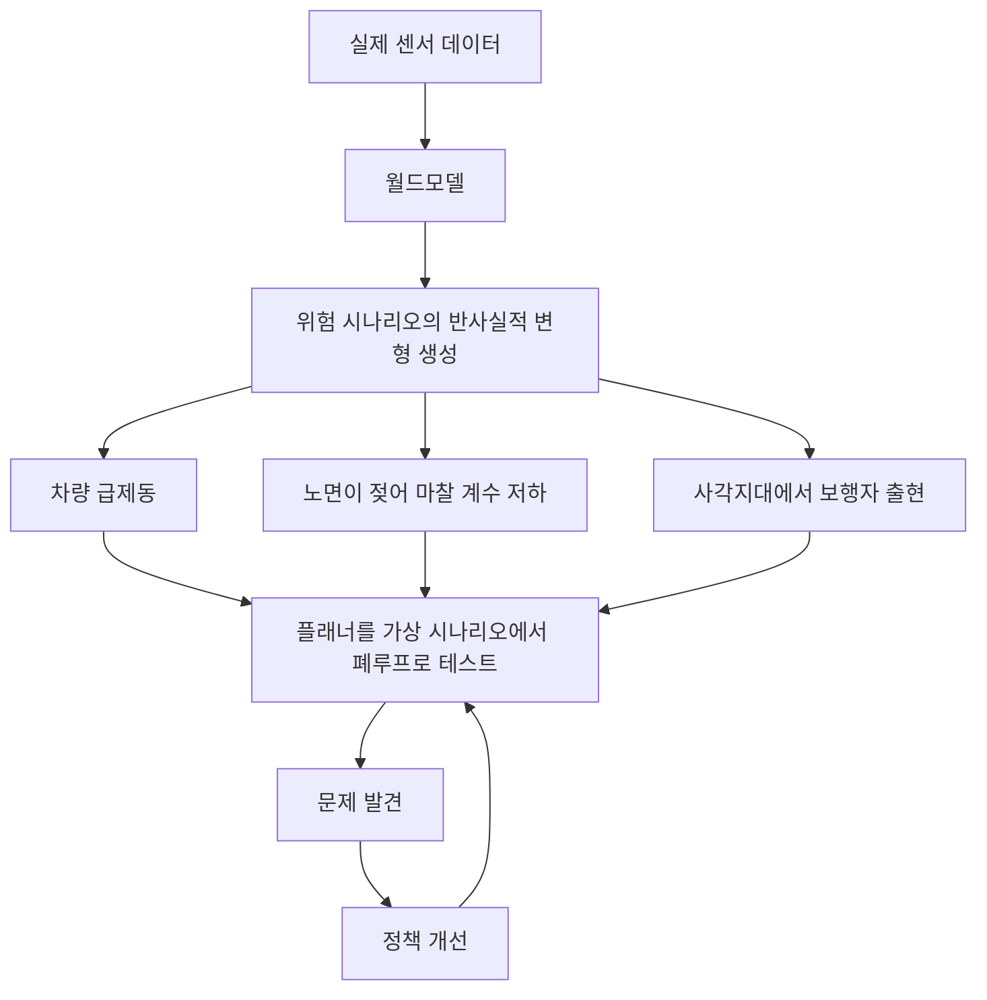

# 월드모델은 무엇을 해결하는가, 그리고 왜 지금인가

## 월드모델은 어떤 문제를 해결할까요?

**1. 샘플 복잡도**

> **📖 배경지식: 강화학습(Reinforcement Learning, RL)**
> 강화학습은 에이전트(Agent)가 환경과 상호작용하며 학습하는 프레임워크로, 매 시간 스텝마다 에이전트가 **동작**(action)을 선택하면 환경은 새로운 **관측**과 **보상 신호**(reward)를 반환합니다(값이 클수록 더 좋은 결과). 이때 에이전트의 목표는 각 상태에서 어떤 동작을 취해야 장기 누적 보상을 최대화할 수 있는지를 결정하는 **정책**(policy)을 학습하는 것입니다.
>
> **모델 프리 RL(model-free RL)**: 에이전트가 환경과의 반복적인 시행착오로부터 곧바로 정책을 학습하며, "세계가 어떻게 돌아가는지"에 대한 어떠한 내부 모델도 만들지 않습니다. 단순하다는 장점이 있지만, 학습에 극히 많은 실제 상호작용("샘플")이 필요하다는 단점이 있습니다.
>
> **모델 기반 RL(model-based RL)**: 먼저 월드모델을 학습(동작의 결과를 예측)한 다음, 이 모델을 이용해 "상상" 속에서 대량의 궤적을 시뮬레이션함으로써 실제 환경과의 상호작용 횟수를 줄입니다.

모델 프리 강화학습은 단순한 태스크 하나를 배우는 데도 수백만 번의 실제 상호작용이 필요합니다. 월드모델은 에이전트가 내부 시뮬레이션을 통해 수만 개의 **롤아웃**(초기 상태에서 출발해 정책에 따라 동작을 실행하는 완전한 시퀀스)을 "가상으로 경험"할 수 있게 해주며, 실제 환경과의 상호작용을 몇 자릿수나 줄여줍니다.

**2. 계획 능력**
월드모델이 있으면 에이전트는 실제 환경에서 무작정 벽에 부딪히는 대신, 행동하기 전에 머릿속으로 여러 경로를 먼저 걸어보고 기대 보상이 가장 높은 경로를 고를 수 있습니다.

**3. 안전성**
로봇, 자율 주행, 산업 제어 같은 상황에서는 시행착오의 대가가 재앙적일 수 있는데, 월드모델은 실제 시스템을 실험대로 삼는 대신 "샌드박스 안에서 정책을 무너뜨렸다가 다시 고치는" 일을 가능하게 해줍니다.

## 중간의 침체: 월드모델은 왜 식었을까요

2018년부터 2020년까지 이어진 초기 열풍이 지나간 뒤, 월드모델 분야는 점차 식어갔습니다. Dreamer, RSSM, PlaNet은 실질적인 학계의 관심을 끌었지만, 연구가 이어지면서 예측 품질이 시간이 지날수록 빠르게 저하되고, 장기 예측 궤적이 무너지며, 오차가 점점 누적되고, 생성된 비디오 프레임이 불과 몇 스텝 만에 뭉개지는 등 고질적인 문제들이 드러났습니다. 이는 단순한 공학적 결함이 아니라, 더 근본적인 능력의 공백을 가리키는 문제였습니다.

같은 시기, 더 큰 물결은 다른 곳에서 밀려오고 있었는데, Scaling Law의 성공은 많은 연구자들에게 데이터와 모델이 충분히 크기만 하면 엔드투엔드로 곧바로 문제를 풀 수 있다는 믿음을 주었으며, VLM과 VLA의 능력은 실제로 폭발적으로 성장했습니다. 그러자 월드모델은 오히려 시대에 뒤처진 낡은 아이디어처럼 보이기 시작했습니다.

돌이켜보면, 문제는 아이디어 자체가 틀렸다는 데 있지 않았습니다. 오히려 문제는 그것을 작동시키는 데 필요한 생성 능력이 당시에는 아예 존재하지 않았다는 데 있었습니다. 구체적으로, 월드모델은 어긋나지도 무너지지도 않으면서 일관된 미래를 안정적으로 한 단계씩 생성해야 하는데, 초기의 비디오 예측 아키텍처는 이것을 해내지 못해서 몇 프레임만 지나면 출력이 흐릿한 잡음으로 뭉개졌습니다.

이 상황을 바꾼 것은 확산 모델과 비디오 파운데이션 모델로, AI 시스템은 처음으로 시간적으로 일관된 세계 상태를 연속적으로 생성하는 능력을 갖추게 되었습니다. 이것이 바로 월드모델이 부활한 근본 원인으로, 새로운 이론적 돌파구가 아니라 새롭게 얻어진 생성 능력이 낡은 아이디어를 갑자기 실현 가능하게 만든 것입니다.

이 논리가 갖는 함의는 놓치기 쉬운데, 확산 모델의 가장 중요한 의의는 어쩌면 이미지 생성이 전혀 아닐 수도 있습니다. 오히려 AI가 처음으로 세계가 어떻게 전개되는지를 모델링할 수 있는 능력을 갖추게 되었다는 데 있을지 모르는데, 현실 세계 자체가 하나의 연속적으로 전개되는 과정이며 비디오는 그 과정을 시간에 따라 샘플링한 것에 지나지 않기 때문입니다.

## 월드모델은 왜 지금 다시 뜨거워지고 있을까요?

월드모델은 새로운 개념이 아닙니다. Ha & Schmidhuber의 논문[2]은 2018년에 발표되었고, 그보다도 앞선 모델 기반 강화학습(MBRL)은 2000년대부터 줄곧 환경 동역학을 학습해왔으며, Dreamer도 이미 세 번째 버전까지 반복 개선되었습니다. 그렇다면 왜 2024년부터 2026년 사이, 이 분야는 갑자기 모든 AI 학회의 주인공이 되었을까요?

답은 어느 한 편의 논문이 아니라, **세 갈래의 기술 흐름이 같은 시간대에 교차**하며 만들어낸 공명입니다.

### 첫 번째 흐름: 비디오 생성 모델이 갑자기 강력해지다

Veo(Google DeepMind), Genie(Google DeepMind), Cosmos(NVIDIA)와 같은 비디오 생성 모델들이 2024년에 집중적으로 등장하며, 대규모 비디오 사전학습이 지닌 놀라운 능력을 보여주었습니다.

이런 모델들이 사실적인 비디오를 생성하는 과정에서 **공간 구조에 대한 감각, 물체 지속성, 대략적인 물리 법칙** 같은 것을 부수적으로 학습하는 것은 아닐지, 연구자들은 진지하게 고민하게 되었습니다. 만약 그렇다면, 이들을 로봇이나 에이전트의 기반 월드모델로 쓸 수 있지 않을까요?

이 질문에는 아직 확실한 답이 없지만, 바로 이 질문이 비디오 생성 분야와 로봇 제어 분야를 같은 논의 테이블로 이끌었습니다.

### 두 번째 흐름: 엠보디드 AI(Embodied Intelligence)가 데이터 병목에 부딪히다

비전-언어-행동 모델(VLA, Vision-Language-Action model, 시각 관측과 언어 지시를 입력받아 로봇 동작을 직접 출력하는 엔드투엔드 모델로 RT-2, OpenVLA 등이 있습니다)은 범용 로봇 기술의 가능성을 보여주었지만, 여기에는 치명적인 의존성이 하나 있습니다. 바로 **대량의 텔레오퍼레이션(teleoperation) 시연 데이터**입니다.

> **📖 텔레오퍼레이션(원격 조작)**: 조작자가 조이스틱, 데이터 글러브, 또는 외골격을 이용해 로봇을 실시간으로 제어하고, 로봇은 그와 동시에 관측과 그에 대응하는 관절 동작을 기록합니다. 이렇게 얻은 데이터는 형식이 잘 정돈되어 있고 주석도 완전하지만, 전문 하드웨어와 숙련된 조작자, 상당한 시간이 필요해 수집 비용이 극도로 높으며, 시간당 데이터 수집 비용이 수천 달러에 이를 수 있습니다.

로봇 조작 시연 데이터를 하나 수집하려면 전문 하드웨어, 숙련된 조작자, 실제 물리적 환경이 필요합니다. 반면 인터넷에는 인간이 물체를 조작하는 영상이 수십억 개나 있지만, 이 영상들에는 동작 주석도, 관절 각도도, 토크 신호도 없습니다.

월드모델은 이 병목을 우회하는 하나의 방법을 제시합니다. 만약 월드모델이 동작 주석이 없는 비디오만으로 "사람이 물체와 어떻게 상호작용하는지"를 학습할 수 있고, 여기에 **잠재 동작**(latent action, 비디오 프레임 간의 차이에서 자동으로 추출되는 암묵적 동작 인코딩으로, 구체적인 관절 각도에 대응하지 않고 "인접한 프레임 사이에 어떤 종류의 변화가 일어났는지"를 포착합니다. 자세한 내용은 L03의 Genie 절을 참고)을 결합해 이 이해를 제어 가능한 동역학 모델로 바꿀 수 있다면, 로봇은 인터넷 비디오로부터 "간접적으로 학습"할 수 있게 되며, 모든 동작에 사람이 일일이 주석을 달 필요가 없어집니다.

이는 아직 해결된 문제가 아니지만, 그 유혹이 충분히 커서 거의 모든 최상위 로보틱스 팀들이 이 방향에 승부를 걸고 있습니다.

<figure>

<figcaption>Hu et al. (2023) GAIA-1의 아키텍처 개요. 과거 비디오 프레임 시퀀스, 자연어 설명, 동작 신호를 결합한 입력으로부터, 생성형 월드모델이 미래 비디오 프레임을 예측하여 주행 시나리오를 제어 가능한 형태로 시뮬레이션합니다. GAIA-1은 "비디오 생성 능력이 자율 주행의 반사실 테스트에 직접 쓰일 수 있다"는 가능성을 보여주었으며, 자율 주행과 생성형 월드모델이 교차하는 초기의 대표 사례입니다.</figcaption>
</figure>

### 세 번째 흐름: 자율 주행은 이미 "반사실 시뮬레이션"의 막대한 가치를 입증했다

자율 주행은 월드모델이 가장 먼저 산업 현장에 적용된 사례 중 하나이며, 이미 명확한 상업적 검증을 내놓았습니다.

실제 도로에서 **코너 케이스**(corner case, 정상적인 학습 데이터에는 거의 등장하지 않지만 시스템이 반드시 올바르게 처리해야 하는 희귀한 상황)는 극히 드뭅니다. 폭설 속에서 갑자기 뛰어드는 보행자, 교차로에서 전복되는 대형 화물차, 규정을 어기고 무단횡단하는 휠체어 이용자 등, 이런 상황은 수백만 킬로미터마다 한 번 마주칠까 말까 하지만, 바로 이런 지점에서 자율 주행 시스템이 가장 쉽게 오류를 냅니다.

월드모델이 제시하는 해법은 다음과 같습니다.

Wayve(영국의 자율 주행 기업)의 GAIA-1, Tesla의 월드모델 시뮬레이션, Waabi(캐나다의 자율 주행 스타트업)의 반사실 학습 등, 이러한 산업 현장의 실제 배포 사례들은 월드모델 기반의 데이터 증강이 안전에 직결되는 테스트의 커버리지를 몇 자릿수나 끌어올릴 수 있으면서도, 비용은 실제 도로 테스트의 천분의 일에 불과하다는 것을 이미 입증했습니다.

### 세 가지 흐름의 교차

세 가지 흐름을 함께 놓고 보면, 오늘날 월드모델 열풍의 본질이 명확해집니다.

이것은 논문 한 편이 만들어낸 유행이 아니라, **대규모 비디오 생성, 로봇 학습, 자율 주행 시뮬레이션**이라는 세 개의 독립된 트랙이 2024년에서 2026년 사이 동시에 월드모델을 각자 문제의 핵심 퍼즐 조각으로 발견한 결과입니다. 비디오 생성 모델은 재사용 가능한 물리적 사전 지식을 제공했고, 엠보디드 AI는 동작 주석의 데이터 병목을 드러냈으며, 자율 주행은 시뮬레이션 안에서 반사실 테스트를 하는 것의 상업적 가치를 입증했습니다. 세 힘이 한데 모여 이 분야를 중심 무대로 밀어 올린 것입니다.

지난번 월드모델 열풍(2018-2020)은 학계가 주도했는데, 연구자들이 게임 환경에서 실현 가능성을 입증하긴 했지만 실제 현장 적용은 아직 멀리 있었습니다. 이번(2024년 이후)에는 산업계와 학계가 동시에 뛰어들었는데, 이는 이미 실제 비용 병목과 안전 요구에 맞닿아 있기 때문입니다. 이러한 두 번의 열풍은 그 온도부터가 완전히 다릅니다.

## 다음 강의

"왜 월드모델이 필요한가"를 알았다면, 다음 질문은 "어떻게 만드는가"입니다. L02는 고차원 픽셀을 다루기 쉬운 잠재 벡터로 어떻게 압축할 것인가(VAE 인코더), 그리고 이 저차원 공간에서 미래 상태를 어떻게 예측할 것인가(GRU에서 MDN-RNN을 거쳐 RSSM으로)라는, 가장 기초적인 두 가지 공학적 문제에서 출발합니다. 이 두 가지를 잘 해내면 Dreamer의 핵심 골격이 마련됩니다.
