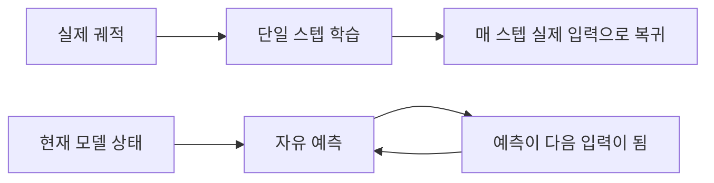

# 학습 분포와 자유 롤아웃

다음 프레임을 정확히 예측하는 모델도 열 스텝을 연속 생성하면 완전히 빗나갈 수 있습니다. 단일 스텝 모델이 약해서가 아니라, 학습할 때는 매 스텝 실제 데이터에서 출발하지만 사용할 때는 자신의 예측에서 출발해야 하기 때문일 수 있습니다.

이는 "한 스텝을 예측하는 모델"과 "의사결정을 지원하는 모델" 사이에서 가장 중요한 간극입니다. 이 페이지를 읽고 나면 teacher-forced 롤아웃과 자유 롤아웃을 구분하고, RSSM의 사후 분포 학습과 사전 분포 상상 사이의 분포 차이를 설명하며, 불확실성이 계획에 어떻게 들어가야 하는지 판단할 수 있어야 합니다.

## 하나의 모델이 두 입력 분포를 만난다

자기회귀 모델은 학습할 때 흔히 **teacher forcing**을 사용합니다. $t+1$ 스텝을 예측할 때 입력은 데이터셋의 실제 이력에서 옵니다. 손실은 다음처럼 쓸 수 있습니다.

$$
\mathcal{L}_{\mathrm{1step}}
=\mathbb{E}_{(x_t,a_t,x_{t+1})\sim\mathcal{D}}
\left[\ell\bigl(f_\theta(x_t,a_t),x_{t+1}\bigr)\right]
$$

자유 롤아웃에서는 첫 스텝 이후의 입력이 모델 자신에게서 옵니다. 첫 예측이 $\hat{x}_{t+1}$이면 다음 호출은 학습 때의 $f_\theta(x_{t+1},a_{t+1})$가 아니라 $f_\theta(\hat{x}_{t+1},a_{t+1})$입니다. 작은 오차가 다음 입력을 바꾸고, 어긋난 입력이 더 큰 오차를 만들 수 있습니다.

그림의 핵심은 두 모델이 아니라 하나의 모델이 두 입력 분포에서 작동한다는 점입니다. 위쪽 경로만 측정하는 학습 지표로는 아래쪽 폐루프의 안정성을 보장할 수 없습니다.

## RSSM의 사후 분포 학습과 사전 분포 상상

RSSM은 같은 문제를 잠재 공간에서 다룹니다. 학습 단계에서는 현재 관측으로 사후 분포 $q(z_t\mid h_t,o_t)$를 구성해 잠재 상태를 실제 궤적 근처로 계속 되돌릴 수 있습니다. 상상 단계에는 미래 관측이 없으므로 사전 분포 $p(z_t\mid h_t)$에서 샘플링하고 그 결과를 전이 모델에 다시 넣어야 합니다.

사전 분포와 사후 분포 사이의 KL 손실은 단순히 두 분포의 모양을 비슷하게 만드는 항이 아닙니다. 학습 경로와 사용 경로의 간극을 줄이는 역할을 합니다. 사전 분포가 한 스텝에서는 사후 분포와 비슷하지만 반복 롤아웃에서 빠르게 표류한다면, 에이전트는 여전히 비현실적인 잠재 세계에서 정책을 학습하게 됩니다.

## 오차가 누적되는 이유

실제 전이를 $T$, 학습한 전이를 $\hat{T}$라고 하겠습니다. 단일 스텝 오차가 제한되어 있어도 $H$ 스텝 뒤의 오차는 단일 스텝 근사 오차, 입력 교란에 대한 동역학의 민감도, 모델이 학습 데이터 밖 상태를 방문하는 정도에 좌우됩니다. 대략 다음처럼 이해할 수 있습니다.

$$
e_H \lesssim \sum_{k=0}^{H-1} L^k\epsilon
$$

$\epsilon$은 단일 스텝 오차이고 $L$은 전이가 입력 편차를 확대하는지 줄이는지를 나타냅니다. $L>1$이면 작은 $\epsilon$도 장기적으로 빠르게 커질 수 있습니다. 따라서 단일 스텝 손실만으로는 모델이 얼마나 멀리 안정적으로 상상할 수 있는지 알 수 없습니다.

## 플래너는 모델의 오류를 찾아낸다

일반 예측기는 입력을 수동적으로 받지만 플래너는 행동 시퀀스를 능동적으로 탐색합니다. 모델이 낯선 영역에서 높은 보상을 잘못 예측하면 CEM, MPC, 정책 최적화가 그 영역으로 가는 행동을 반복해서 고를 수 있습니다. 오류가 무작위로 확대되는 것이 아니라 최적화기에 가장 이익이 되어 보이는 오류가 확대됩니다.

여기서는 두 종류의 불확실성을 구분해야 합니다.

| 종류 | 원인 | 데이터로 줄일 수 있는가 | 의사결정 측 대응 |
| --- | --- | --- | --- |
| 인식적 불확실성 | 모델이 이 상태나 동역학을 충분히 보지 못함 | 대체로 가능 | 앙상블 불일치, 보수적 패널티, 능동 샘플링 |
| 우연적 불확실성 | 환경 자체에 무작위성이 존재함 | 대체로 불가능 | 분포 예측, 위험 민감 목표 |

예측 분포가 넓다는 것과 모델이 자신의 정답 여부를 안다는 것은 다릅니다. 하나의 확률적 모델은 여러 미래를 표현하면서도 학습 분포 밖에서는 과도하게 자신할 수 있습니다.

## 학습과 사용의 간극 줄이기

한 가지 기법으로 문제 전체를 없앨 수는 없습니다. 방법마다 다른 인터페이스에 작용합니다.

- **자유 롤아웃 검증**: 단일 스텝 손실만 보지 않고 1, 3, 5, 10 스텝 오차를 보고합니다.
- **다중 스텝 목표**: 학습 중에도 모델 자신의 예측이 만든 입력 편차를 일부 경험하게 합니다.
- **사전-사후 정렬**: KL뿐 아니라 장기 잠재 표류도 검사합니다.
- **모델 앙상블**: 구성원 간 불일치로 인식적 불확실성을 근사합니다.
- **보수적 계획**: 예측 보상에서 불확실성 패널티를 빼 낯선 영역에 베팅하지 않게 합니다.
- **이동 지평 재계획**: MPC는 첫 행동만 실행한 뒤 실제 관측으로 상태 추정을 갱신합니다.
- **정책 인식 데이터 수집**: 플래너가 실제 방문하는 상태를 학습 데이터에 다시 넣습니다.

## P02와 다음 강의에 미치는 영향

P02에서는 GRU, MDN-RNN, RSSM을 단일 스텝 오차만으로 비교해서는 안 됩니다. Teacher-forced 예측과 자유 롤아웃을 모두 살펴보고 지평에 따른 오차 곡선을 그려야 합니다. 두 모델의 단일 스텝 점수가 비슷할 때 어느 모델이 계획에 적합한지는 장기 곡선이 더 잘 설명하는 경우가 많습니다.

다음 강의에서는 예측을 CEM-MPC, 잠재 Actor-Critic, TD-MPC에 넘깁니다. 계획으로 넘어가기 전에 한 가지 판단을 기억하세요. **계획 품질은 모델의 평균 정확도뿐 아니라 어디서 틀리는지, 틀릴 수 있음을 알고 있는지, 실제 피드백이 얼마나 빨리 오류를 보정하는지에도 달려 있습니다.**

## 이해 점검

1. Teacher-forced 단일 스텝 손실이 낮아도 자유 롤아웃의 신뢰성이 보장되지 않는 이유는 무엇입니까?
2. RSSM의 사후 분포 상태를 미래 상상에 직접 사용할 수 없는 이유는 무엇입니까?
3. 플래너가 학습 데이터에서 드문 행동만 반복해서 고른다면, 실제 고수익과 모델 악용을 구분하기 위해 어떤 두 종류의 증거를 기록하겠습니까?
