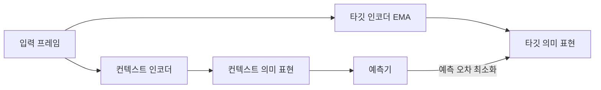

# 최전선 연구 동향: JEPA와 RWM

이 페이지는 선택 사항이며, P03과 P04에서 구현하지 않은 백본까지 비교 범위를 넓히는 내용입니다. JEPA는 "무엇을 예측해야 하는가"를 묻고, RWM은 "로봇 배포 환경에서 예측이 어떻게 신뢰성을 유지하는가"를 묻습니다.

## 아키텍처 4: JEPA(2023, 비생성형)

**대표 시스템**: I-JEPA(2023), V-JEPA(2024), V-JEPA 2(2025), Yann LeCun이 주도([LeCun, 2022](https://openreview.net/forum?id=BZ5a1r-kVsf))

### 핵심 메커니즘

JEPA(Joint Embedding Predictive Architecture)의 핵심 발상은 **픽셀을 예측하지 말고, 의미론적 잠재 공간에서 예측하라**는 것입니다.

현재 관측 $x$가 주어지면 인코더가 이를 의미 표현 $s_x$로 매핑하고, 예측기는 맥락을 바탕으로 대상 영역의 픽셀 $y$를 재구성하는 대신 그 표현 $s_y$를 예측합니다.

$$\hat{s}_y = f_\theta(s_x,\, \text{context})$$

픽셀 공간은 과제와 무관한 정보로 가득 차 있습니다. 조명 변화, 텍스처 디테일, 그림자 방향, 센서 노이즈 같은 것들입니다. 픽셀 단위로 재구성하는 모델은 "이 조명 각도에서 이 피부 부위가 무슨 색이어야 하는가"를 학습하는 데 모델 용량을 써야 하는데, 이는 "이 손이 컵을 쥐고 있는가"를 이해하는 데는 아무 도움이 되지 않습니다. 더 근본적인 문제는, 평균제곱오차를 쓰면 모델이 흐릿한 "평균 이미지"를 출력하게 되고, GAN은 선명한 이미지를 만들 수 있지만 학습 불안정성을 끌어들인다는 점입니다. JEPA의 답은 **애초에 픽셀 공간에 들어가지 않고, 의미 레벨에서 곧바로 예측하는 것**입니다.

### 컨텍스트 인코더 + 예측기 + 타깃 인코더 삼총사

학습 목표는 예측기 출력과 타깃 표현 사이의 L2 거리를 최소화하는 것입니다.

$$\mathcal{L}_{\text{JEPA}} = \|\text{predictor}(s_x) - s_y\|^2$$

> **📖 stop-gradient와 EMA**: `stop_gradient(s_y)`는 $s_y$를 계산하는 과정이 역전파에 참여하지 않는다는 뜻으로, 그라디언트가 여기서 끊깁니다. EMA 업데이트 규칙은 $\xi \leftarrow \tau \xi + (1-\tau) \theta$이며, $\tau \approx 0.996$이라 타깃 인코더는 극도로 느린 속도로 컨텍스트 인코더를 "따라갑니다". 이런 제약이 없으면 모델은 "모든 입력을 같은 벡터로 매핑하는" 지름길로 손실을 최소화해버릴 수 있는데(**표현 붕괴**), EMA와 stop-gradient의 조합은 두 인코더가 서로 다른 속도로 업데이트되게 만들어 붕괴를 낳는 대칭성 자체를 깨뜨립니다.

Meta는 2025년 V-JEPA 2를 발표하면서 이를 비디오 생성기가 아니라 "**AGI로 가는 월드모델 구성요소**"로 명확히 자리매김했습니다. V-JEPA 2는 동작 시퀀스가 주어지면 의미 공간에서 미래의 시각적 표현을 예측하는데, 목표는 사실적인 비디오를 생성하는 것이 아니라 "팔을 이렇게 움직이면 물체가 어디에 있을지"를 이해하는 것입니다.

**학습 패러다임**: 주로 관측형입니다. 학습 데이터는 비디오 시퀀스이며 동작 레이블이 필요 없습니다. JEPA는 "누가 더 사실적인 비디오를 생성하는가" 경쟁에 참여하지 않으며, 목표는 "누가 물리 세계를 더 잘 이해하는가"입니다.

**적용 시나리오**: 시각 표현 사전학습, 의미 유사성 과제, 데이터 효율적인 다운스트림 분류·검색에 쓰이며, 앞으로는 범용 월드모델의 토대가 될 것으로 기대됩니다.

**한계**: 출력을 시각화할 수 없고, 평가 지표가 직관적이지 않으며, JEPA 표현을 MPC나 Actor-Critic에 어떻게 활용할지는 아직 열린 문제입니다.

## 아키텍처 5: Robotic World Model(RWM), 로봇 제어의 어려운 문제

**대표 시스템**: Self-Forcing(NeurIPS 2025), RWM-U(ICLR 2026, ETH 취리히), DreamDojo(NVIDIA, 2025)

앞선 네 가지 아키텍처 계열이 주로 경쟁해온 영역은 "생성 품질"이나 "게임 지능(game intelligence)"입니다. 로봇 제어는 한층 더 어려운 부류의 문제로, 핵심은 "사실적인 이미지를 생성할 수 있는가"가 아니라 "실제 세계에 배치할 수 있는 정책을 학습시킬 수 있는가"입니다.

### 두 가지 핵심 문제

**문제 1: 장기 롤아웃 발산**

학습 중에는 모델이 매 스텝마다 **실제 상태**를 입력받지만(teacher forcing), 추론 중에는 모델이 **자기 자신의 예측**을 입력으로 삼아야 합니다(자기회귀 롤아웃). 이 때문에 오차가 누적되어 궤적이 빠르게 실제와 어긋납니다. 학습과 추론 사이의 이 분포 격차 때문에 장기 롤아웃은 물리적으로 불가능한 상태를 만들어냅니다.

**문제 2: 정책의 악용**

정책이 모델의 오류를 능동적으로 찾아내 악용해, 월드모델 안에서는 허위로 높은 보상을 만들어내지만 실제 환경에서는 무의미하거나 심지어 해로운 동작 시퀀스를 발견해버립니다.

**[Self-Forcing](https://arxiv.org/abs/2506.08009)**(NeurIPS 2025)은 학습 중에 추론 시점의 오차 누적을 미리 "시뮬레이션"하는 방식으로 이 문제를 다룹니다. 모델에 항상 실제 상태를 주는 대신 때때로 모델 자신의 이전 예측을 주고, **여러 스텝**에 걸쳐 동시에 실제 상태와의 손실을 계산합니다. 이는 **scheduled sampling**(계획된 샘플링, 학습 초기에는 높은 확률로 실제 과거 프레임을 쓰다가 학습이 진행될수록 모델 자신의 예측 프레임을 쓰는 확률을 점진적으로 높여, 모델이 추론 시의 자기회귀 패턴에 점차 적응하도록 만드는 학습 기법)을 체계화한 버전이며, Diffusion 월드모델 환경에서 검증한 결과 Self-Forcing은 50스텝 롤아웃의 누적 오차를 teacher forcing 대비 약 3분의 1로 줄였습니다.

**[RWM-U](https://arxiv.org/abs/2504.16680)**(Uncertainty-Aware Robotic World Model, ICLR 2026, ETH 취리히, Krause, Hutter)는 **오프라인 MBRL**(Offline Model-Based RL)을 위해 특별히 설계되었습니다. 온라인 환경 상호작용에 의존하지 않고, 고정된 과거 데이터셋만으로 월드모델을 학습한 뒤 그 월드모델 내부에서 정책을 전적으로 학습시킵니다. 이런 순수 오프라인 설정은 실제 로봇에서 특히 값진데, 온라인 상호작용은 비용이 크고 안전 위험도 있기 때문입니다.

RWM-U의 핵심 메커니즘은 **앙상블 불확실성 추정**(ensemble uncertainty estimation, 여러 개의 독립된 모델을 동시에 학습시키고 그 예측들 사이의 불일치 정도로 불확실성을 정량화하는 방법으로, 예측이 일치할수록 그 영역의 데이터가 충분하다는 뜻이고 불일치가 클수록 데이터가 희소하다는 뜻입니다)입니다. 구체적으로는, 독립적으로 초기화된 $N$개의 자기회귀 월드모델을 동시에 학습시키고, 이들 예측의 **앙상블 분산**(ensemble variance, 여러 모델이 같은 입력에 대해 내놓은 예측들의 통계적 분산)으로 인지적 불확실성(epistemic uncertainty)을 정량화하며, 이 불확실성을 롤아웃 궤적 전체에 걸쳐 일관되게 전파합니다. 정책 최적화 시에는 불확실성이 높은 영역에 페널티를 부과하며, off-policy 알고리즘보다 안정적인 **PPO**(Proximal Policy Optimization, 근접 정책 최적화, 매 파라미터 업데이트의 크기를 제한해 학습 안정성을 유지하는 on-policy 그라디언트 알고리즘)를 사용합니다.

$$\text{정책 보상} = \text{과제 보상} - \lambda \times \text{불확실성}$$

불확실성이 높은 영역에 페널티를 줌으로써, 정책이 모델을 신뢰할 수 있는 상태 분포 안에 머물도록 유도합니다. 저자들은 사족보행 로봇과 인간형 로봇의 조작·이동 과제에서 이 프레임워크를 검증했으며, 정책 성능은 불확실성을 고려하지 않는 기준선을 꾸준히 앞질렀고, 소량의 실제 로봇 데이터로 오프라인 데이터셋을 보강하자 순수 시뮬레이션 온라인 기준선보다도 더 나은 성능을 냈습니다.

> **📖 인지적 불확실성(epistemic uncertainty)**: 모델이 "충분히 많은 데이터를 보지 못한 데서" 비롯되는 불확실성입니다. 학습 데이터가 충분히 있는 영역에서는 여러 독립 모델이 비슷한 예측을 내놓지만(분산이 작음), 학습 데이터가 희소한 영역에서는 모델마다 예측이 크게 엇갈립니다(분산이 큼). 이는 환경 자체에 내재된 무작위성에서 비롯되는 우연적 불확실성(aleatoric uncertainty)과는 다릅니다. 인지적 불확실성은 데이터를 더 모으면 줄일 수 있지만, 우연적 불확실성은 그럴 수 없습니다.

**[DreamDojo](https://arxiv.org/abs/2602.06949)**(NVIDIA 외, 2025)는 다른 각도에서 데이터 부족 문제를 풉니다. **대규모 인간 1인칭 시점 비디오**로부터 직접 학습하는데, 이런 인간 비디오에는 동작 주석이 전혀 필요 없습니다.

<figure>

<figcaption>LAM의 정보 병목 설계. 인코더는 인접한 두 프레임 (f^t, f^{t+1})을 입력받아 프레임 간 변화를 저차원 연속 벡터 â_t(잠재 동작)로 압축하고, 디코더는 â_t와 f^t를 조건으로 f^{t+1}을 재구성합니다. 서로 다른 장면에서 사람 손과 로봇 팔이 같은 종류의 동작을 수행할 때 LAM이 만들어내는 잠재 벡터가 매우 비슷해, 서로 다른 신체 형태 간의 전이가 가능해집니다.</figcaption>
</figure>

핵심 기술은 **LAM**(Latent Action Model, 잠재 동작 모델)으로, VAE 구조를 이용해 연속된 프레임 쌍 $(f^t, f^{t+1})$에서 **연속적인 잠재 동작** $\hat{a}_t$를 자기지도 방식으로 추출합니다. 정보 병목이 조명이나 텍스처 같은 무관한 변수는 걸러내고 "프레임 사이에 어떤 종류의 동작이 일어났는가"만 남깁니다. 사전학습 때는 $\hat{a}_t$를 조건으로 미래 프레임을 예측하고, 후속학습 때는 소량의 주석 달린 로봇 데이터로 잠재 동작을 실제 제어 공간에 정렬시킵니다. Teacher 모델은 2단계 증류를 거쳐 인과적 어텐션을 쓰는 Student 모델로 압축되며, 실시간 원격조작에 충분한 추론 속도를 달성합니다.

**학습 패러다임**: 관측 기반 사전학습(인간 비디오, 동작 주석 없음)에 이어 소량의 목표 데이터로 후속학습을 진행합니다.

**적용 시나리오**: 고빈도 로봇 제어, 오프라인 데이터는 풍부하지만 온라인 상호작용 비용이 큰 시나리오.
