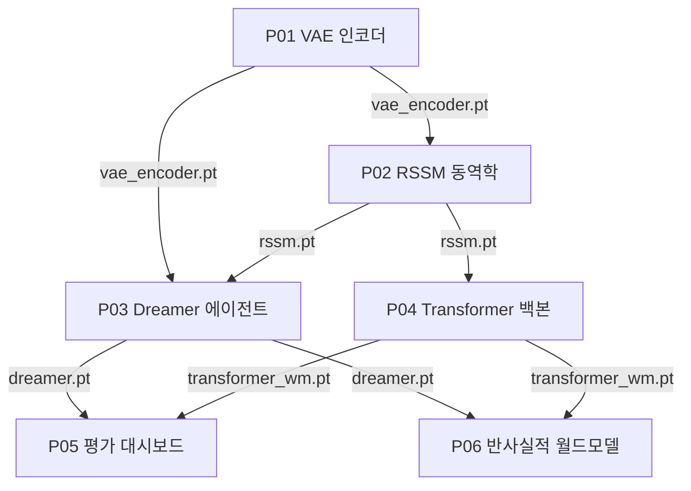

# 프로젝트

여섯 개의 실습 프로젝트를 통해 처음부터 완전한 월드모델 파이프라인을 구축합니다. 순서대로 진행하는 것이 좋습니다. P01의 인코더는 P02의 관측 인코더가 되고, P02의 동역학 모델은 P03의 백본이자 P04의 기준선이 되며, P03과 P04에서 학습된 두 시스템은 P05에서 비교되고, P06은 이 두 시스템의 인과적 정확도(causal fidelity)를 검증합니다. 각 프로젝트는 노트북 중심의 튜토리얼로 CPU, GPU, TPU 어디서든 실행되고, 합성 데이터만 사용하며, 체크포인트를 다음 단계로 전달합니다.

## 하드웨어 요구 사항

이 절의 모든 노트북은 Google Colab에서 T4 GPU(16GB) 한 대로 개발되고 실행되었습니다. 비슷하거나 더 큰 메모리와 연산 능력을 가진 가속기라면, 즉 Nvidia GPU든 AMD GPU든 동급 이상 세대의 TPU든, 여섯 프로젝트 전부를 별다른 수정 없이 실행할 수 있습니다. 중급 소비자용 GPU 한 대면 충분하며, 어떤 프로젝트도 멀티 GPU 학습을 요구하지 않습니다.

적절한 GPU를 갖춘 컴퓨터가 아직 없다면, 다음 클라우드 옵션들이 잘 작동합니다.

| 제공자 | 하드웨어 | 적합한 용도 | 링크 |
|---|---|---|---|
| Google Colab | T4, L4, A100 | 이 강좌의 기준 환경입니다. 무료 등급으로도 스모크 테스트가 가능하고, Pro는 안정적인 T4/L4 접근성을 제공합니다 | [colab.research.google.com/signup](https://colab.research.google.com/signup) |
| Kaggle Notebooks | T4 x2, P100 | 주당 30 GPU시간을 구독 없이 무료로 제공합니다 | [kaggle.com/docs/notebooks](https://www.kaggle.com/docs/notebooks) |
| AMD Developer Cloud | MI300X | AMD GPU에서 ROCm 호환성을 테스트해볼 무료 체험 크레딧을 제공합니다 | [amd.com/en/developer/resources/cloud-access.html](https://www.amd.com/en/developer/resources/cloud-access.html) |
| Lambda Cloud | A10, A100, H100 | 장기 약정 없이 시간당 과금되는 온디맨드 Nvidia 인스턴스입니다 | [lambda.ai/service/gpu-cloud](https://lambda.ai/service/gpu-cloud) |
| RunPod | 다양한 GPU, 커뮤니티/시큐어 클라우드 등급 | 짧은 학습 실행에 적합한 저렴한 온디맨드/스팟 가격입니다 | [runpod.io](https://www.runpod.io/) |
| Google Cloud TPU | TPU v4/v5e | TPU 코드 경로를 특별히 검증하고 싶을 때 적합합니다 | [cloud.google.com/tpu](https://cloud.google.com/tpu) |

위 제공자 전부에서 이 노트북들이 수정 없이 실행됨을 확인했습니다. 코드는 CUDA 전용 호출 없이 표준 PyTorch 연산만 사용하므로, AMD 하드웨어의 ROCm 위에서도 수정 없이 그대로 실행됩니다.

마크다운 페이지에는 서술 텍스트와 코드만 담겨 있습니다. 출력, 그래프, 표 등 다른 산출물은 해당 `.ipynb` 노트북 파일에 있습니다.

Jupyter나 Colab에서 아무 노트북이나 열어 처음부터 끝까지 실행해보세요. 상위 체크포인트가 없으면 노트북은 무작위 초기화로 대체되어 스모크 테스트로는 여전히 작동하지만, 실제 체크포인트가 갖춰져야만 프로젝트 간 비교가 의미를 갖습니다.

## 프로젝트 순서

| # | 프로젝트 | 선행 조건 | 체크포인트 | 결과물 |
|---|---------|--------------|-------|-------------|
| P01 | [VAE 인코더 학습](./p01_vae_encoder) | L02: 관측 인코딩 | `vae_encoder.pt` | 64×64 프레임에 대한 CNN VAE, ELBO 손실 곡선, 분리된 차원을 보여주는 잠재 순회 |
| P02 | [RSSM 동역학 모델 구축](./p02_rssm_dynamics) | P01, L02: 잠재 동역학 | `rssm.pt` | GRU, MDN-RNN, RSSM 비교, 롤아웃 그래프, 1스텝~5스텝 예측 오차 곡선 |
| P03 | [Dreamer 에이전트 학습](./p03_dreamer_agent) | P02, L03: 계획과 제어 | `dreamer.pt` | 인코더 + RSSM + 잠재 Actor-Critic 학습 루프, 보상 곡선, FID와 보상 상관관계 자체 평가 |
| P04 | [동역학 백본 교체](./p04_transformer_backbone) | P03, L03: 백본 선택 | `transformer_wm.pt` | RSSM을 STORM 방식의 범주형 VAE와 인과적 Transformer로 교체, 아키텍처 비교 리포트 |
| P05 | [월드모델 평가 대시보드](./p05_evaluation_dashboard) | P03, P04, L04 | -- | 학습된 두 모델을 함께 불러와 채점: PSNR, 보상 상관관계, 토큰 손실, 잠재 드리프트 |
| P06 | [동작 조건화 반사실적 월드모델](./p06_counterfactual_world_model) | P03, P04 | `causal_wm.pt` | Pearl의 인과의 사다리 분석: 개입적/반사실적 롤아웃, 역동역학으로 정규화한 월드모델, 동작 영향력 지표 |

## 체크포인트가 이어지는 방식

프로젝트들은 파이프라인의 이후 단계들로 계속 전달되는 하나의 가중치 파일 집합을 공유합니다. P01은 VAE를 학습시켜 `vae_encoder.pt`를 씁니다. P02는 그 인코더를 불러와 동역학 모델을 학습시키고 `rssm.pt`를 씁니다. 여기서 경로가 갈라집니다. P03은 인코더와 RSSM을 결합해 Dreamer 에이전트를 만들어 `dreamer.pt`로 저장하고, P04는 RSSM을 기준선으로 재사용해 Transformer 백본을 학습시켜 `transformer_wm.pt`로 저장합니다. P05는 `dreamer.pt`와 `transformer_wm.pt`를 모두 불러와 정확도를 평가합니다. P06은 같은 두 체크포인트를 불러와 인과적 정확도를 검증하며, 자체적으로 동작에 대해 정규화된 모델 하나를 학습시켜 `causal_wm.pt`로 저장합니다.

