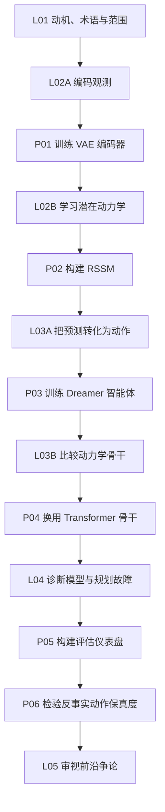

# 课程路线图

## 讲义与项目组成的一条主线

讲义和项目不是两条分开的路线，而是一门课程的两个部分。项目在路线中出现时就停下来完成它。项目保存的检查点会成为下一阶段分析和训练的具体对象，让后续概念始终依附于你已经观察和训练过的系统。

| 阶段 | 先阅读 | 再实践 | 完成后应该能解释 |
| --- | --- | --- | --- |
| 基础 | L01，然后读 L02 Part A | [P01：训练 VAE 编码器](../../projects/p01_vae_encoder) | 观测编码器保留和舍弃了什么信息 |
| 动力学 | L02 Part B 与 Dreamer 系列 | [P02：构建 RSSM](../../projects/p02_rssm_dynamics) | 有用的潜在状态为何同时需要记忆与不确定性 |
| 控制 | L03 Part A | [P03：训练 Dreamer 智能体](../../projects/p03_dreamer_agent) | 想象轨迹如何训练 actor 与 critic |
| 替代架构 | L03 Part B | [P04：替换动力学骨干](../../projects/p04_transformer_backbone) | 何种瓶颈足以支持我们替换 RSSM |
| 评估 | L04 | [P05：构建评估仪表盘](../../projects/p05_evaluation_dashboard) | 每项指标分别诊断表示、rollout 或规划中的哪种故障 |
| 因果性 | L04 后重读 L1-L5 能力阶梯 | [P06：检验反事实保真度](../../projects/p06_counterfactual_world_model) | 动作是否真正导致预测未来变化，而不只是与变化相关 |
| 前沿 | L05 | 无必做项目 | 哪些开放问题属于经验、架构或哲学层面 |

## 下一讲

L02 从一个具体问题出发：**如何把 64×64 的像素图像压缩成一个紧凑的潜在向量 z？** 这是变分自编码器（VAE）的任务，也是整个 Dreamer 流水线的第一块砖。

读完编码部分就完成 P01，不要等到 L02 全部结束。随后回到动力学部分，把学到的表示接入 RSSM，再完成 P02。到这里，你会亲手写出本课程最重要的两个预测组件，并观察它们的误差如何随 rollout 时程变化。

*L01 不要求编程，其中的数学补充均可选读。L02 假设读者掌握深度学习基础，并会在新工具第一次需要时进行解释。*

## 延伸阅读

- Craik, K.J.W. *The Nature of Explanation*. Cambridge University Press, 1943.
- [Ha & Schmidhuber (2018): World Models](https://arxiv.org/abs/1803.10122)：V/M/C 三模块框架，梦中训练的原始论文
- [Hafner et al. (2019): Dream to Control (Dreamer V1)](https://arxiv.org/abs/1912.01603)：RSSM 与潜在 Actor-Critic 的首个端到端实现
- [LeCun (2022): A Path Towards Autonomous Machine Intelligence](https://arxiv.org/abs/2306.15364)：JEPA 框架与世界模型作为认知核心的论点
