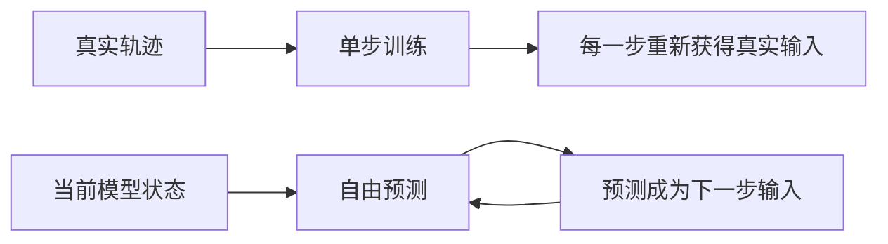

# 训练分布与自由 Rollout

一个模型可以把下一帧预测得很好，却在连续生成十步后彻底偏离。原因不一定是单步模型太弱，而可能是训练时每一步都站在真实数据上，使用时却必须站在自己的预测上。

这是世界模型从“会预测一步”到“可以支撑决策”之间最重要的落差。读完本页，你应该能够区分 teacher-forced 与 free rollout，解释 RSSM 后验训练与先验想象的分布差异，并判断不确定性应当如何进入规划。

## 同一个模型面对两种输入分布

自回归模型训练时常使用 **teacher forcing**：预测第 $t+1$ 步时，输入来自数据集中的真实历史。损失可以写成

$$
\mathcal{L}_{\mathrm{1step}}
=\mathbb{E}_{(x_t,a_t,x_{t+1})\sim\mathcal{D}}
\left[\ell\bigl(f_\theta(x_t,a_t),x_{t+1}\bigr)\right]
$$

自由 rollout 时，第二步开始的输入来自模型自己。若第一步产生 $hat{x}_{t+1}$，下一步计算的是 $f_\theta(\hat{x}_{t+1},a_{t+1})$，而不是训练中见过的 $f_\theta(x_{t+1},a_{t+1})$。一个小误差会改变下一步输入，新的输入偏移又可能制造更大的误差。

这幅图的重点不是两套模型，而是同一个模型在两种输入分布下工作。训练指标只覆盖上半条路径时，无法保证下半条闭环稳定。

## RSSM 中的后验训练与先验想象

RSSM 把同一个问题放进潜在空间。训练阶段可以使用当前观察构造后验
$q(z_t\mid h_t,o_t)$，从而不断把潜在状态拉回真实轨迹附近。想象阶段没有未来观察，只能从先验 $p(z_t\mid h_t)$ 采样，并把采样结果继续送回转移模型。

因此，先验与后验的 KL 损失不只是让两个分布“长得相似”。它在缩小训练路径与使用路径之间的落差。如果先验只在一步上接近后验，却在连续展开时迅速漂移，智能体仍会在一个不真实的潜在世界里学习策略。

## 误差为什么会累积

设真实转移为 $T$，模型转移为 $\hat{T}$。在一步误差有界时，$H$ 步误差仍会受到三个因素影响：单步近似误差、动力学对输入扰动的敏感度，以及模型不断访问偏离训练集的状态。粗略地写，可以把它理解为

$$
e_H \lesssim \sum_{k=0}^{H-1} L^k\epsilon
$$

$\epsilon$ 是单步误差，$L$ 表示转移会把输入偏差放大还是压缩。当 $L>1$ 时，即使 $\epsilon$ 很小，远期误差也可能快速增长。因此，只报告一步损失无法回答模型能可靠想象多远。

## 规划器会寻找模型的错误

普通预测器被动接收输入，规划器却会主动搜索动作序列。只要模型在某个陌生区域错误地预测出高奖励，CEM、MPC 或策略优化就可能反复选择通往该区域的动作。模型不是随机犯错，而是它最有利可图的错误会被优化器放大。

这里需要区分两类不确定性：

| 类型 | 来源 | 更多数据是否能减少 | 决策侧处理 |
| --- | --- | --- | --- |
| 认知不确定性 | 模型没有覆盖该状态或动力学 | 通常可以 | 集成分歧、保守惩罚、主动采样 |
| 偶然不确定性 | 环境本身存在随机性 | 通常不可以 | 分布式预测、风险敏感目标 |

“预测分布很宽”和“模型不知道自己是否正确”不是一回事。单个随机模型可以表达多种未来，却仍可能对分布外区域过度自信。

## 缩小训练与使用的落差

没有一种技巧可以单独消除这一问题。不同方法作用在不同接口：

- **自由 rollout 验证**：按 1、3、5、10 步报告误差，而不是只看一步损失。
- **多步训练目标**：让模型在训练中承担一部分由自身预测产生的输入偏移。
- **先验与后验对齐**：检查 KL 之外的长时程潜在漂移。
- **模型集成**：用成员之间的分歧近似认知不确定性。
- **保守规划**：从预测回报中扣除不确定性惩罚，避免押注陌生区域。
- **滚动重规划**：MPC 每次只执行第一步，再用真实观察刷新状态估计。
- **收集策略访问的数据**：把规划器真正会访问的状态回灌训练集。

## 对 P02 和下一讲的影响

P02 不应只比较 GRU、MDN-RNN 与 RSSM 的单步误差。至少要同时观察 teacher-forced 预测和自由 rollout，并绘制误差随时程增长的曲线。两种模型一步分数接近时，长时程曲线往往更能解释哪一个适合规划。

下一讲会把预测交给 CEM-MPC、潜在 Actor-Critic 与 TD-MPC 使用。进入规划之前，请保留一个判断：**规划性能不仅取决于模型平均有多准，还取决于它在哪里会错、是否知道自己可能错，以及真实反馈多久能把它拉回来。**

## 检查理解

1. 为什么 teacher-forced 单步损失很低，不能证明自由 rollout 可靠？
2. RSSM 的后验状态为何不能直接用于未来想象？
3. 如果规划器总是选择训练数据中罕见的动作，你会记录哪两类证据来区分“真实高收益”与“模型漏洞”？
