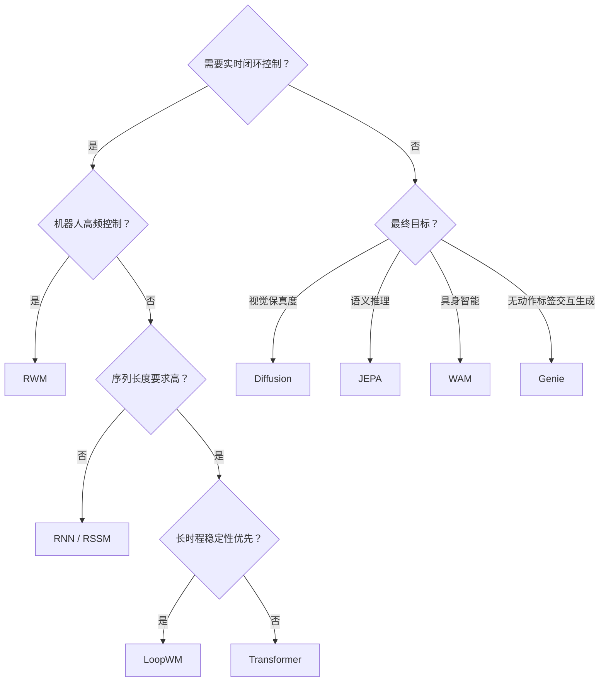

# Part C（续，选读）：LoopWM、WAM 与架构选型

## 架构七：循环动力学模型（LoopWM）

**代表系统**：LoopWM（Looped World Models，[Lu et al., 2026](https://www.emergentmind.com/papers/2606.18208)）

前几个架构族在动力学预测器的深度选择上大多隐含一个假设：更长时程、更高保真的模拟需要更深的网络，而更深的网络意味着更多参数、更高推理成本，也更容易在长 rollout 中累积误差。LoopWM 打破了“深度等于参数量”这个假设：编码器 $E_\phi$ 把观测 $o_k$ 压缩为 $e_k$，动作嵌入器 $A_\psi$ 把动作 $a_k$ 压缩为 $u_k$，两者一起输入 **Looped Dynamics Core** $L_\theta$。这个核心内部分三段：Prelude $P$ 先用 $(h_{k-1}, e_k, u_k)$ 生成条件，Recurrent Block $R$（参数共享）循环 $T$ 次反复精炼隐状态 $h^{(t)} = \bar{A} h^{(t-1)} + \bar{B} e + \text{Transformer residual}$，Coda $C$ 收尾得到 $h_k$ 作为下一步的初始状态。其中 $\bar{A} = \exp(\Delta \, \text{diag}(-\exp(a)))$，保证所有特征值落在 $(0, 1)$ 之间，这个**谱稳定化**约束让每一次循环都是压缩映射，不管循环多少次都不会在长时程 rollout 中发散。$h_k$ 最终经预测头 $D_\xi$ 输出下一步的观测、奖励和终止信号 $(\hat{o}_{k+1}, \hat{r}_{k+1}, d_{k+1})$。

<figure>

<figcaption>Lu et al. (2026) LoopWM 的完整架构：观测和动作分别经编码器 $E_o$、动作嵌入器 $A_a$ 压缩后输入 Looped Dynamics Core；Core 内部分 Prelude（生成条件）、共享 Recurrent Block（循环 $T$ 次，退出门控 $g^{(t)}$ 判断是否提前终止）、Coda（投影得到 $h_k$）三段，谱稳定性保证 $\rho(\bar{A}) < 1$ 使每次循环都是压缩映射；$h_k$ 经预测头输出未来观测、奖励和终止信号，或沿延迟解码路径连续展开多步、只在终止步解码。</figcaption>
</figure>

配合谱稳定化，LoopWM 还把解码推迟到 rollout 序列的最后一步才做（deferred decoding，降低计算开销并让 latent 结构更利于长程规划），并用学到的退出门控实现自适应计算：门控信号超过阈值 $\tau$ 时提前退出循环，简单转移少迭代，复杂转移（比如碰撞）多迭代几轮。训练时循环次数 $T$ 从泊松分布 $\text{Poisson}(\mu_{\text{rec}})$ 中随机采样，配合截断 BPTT 训练，让模型在测试时支持可变深度推理。论文在 ScienceWorld 和 AlfWorld 上验证，约 1B 参数的 LoopWM 在多个指标上超过参数量大 100 倍的闭源基线，同时在长时程任务上保持稳定，循环次数越多、预测质量越好，呈现出与模型规模、数据量正交的第三条 scaling 轴。

**学习范式**：交互型，以动作为条件的 latent 动力学预测器，可以直接替换 RSSM 或标准 Transformer 动力学模型作为 backbone。

**局限**：谱稳定化约束只作用在更新规则的线性保留项上，非线性残差项没有同等的稳定性保证；论文主要在文本交互环境上验证，尚未在像素级连续控制或真实机器人环境上充分验证。

## 架构八：从 World Model 到 World Action Model（WAM）

**代表系统**：Motus (2025, Bi et al.)、DreamZero / WAM (NVIDIA 2026)

Genie 证明了"从视频隐式发现动作表征"这条路可行。WAM 系列接过这个思路，进一步追问：世界模型和策略模型，真的需要是两个分开的模块吗？

| 范式 | 输入 | 输出 |
|------|------|------|
| 世界模型 | 观测 + 动作 | 未来观测或状态 |
| VLA（Vision-Language-Action model，视觉语言动作模型） | 观测 + 语言指令 | 动作 |
| WAM | 观测 + 语言指令 | 未来观测 + 动作 |

传统的 World Model 以动作为输入、预测未来状态，是 policy 旁边的一个 simulator。VLA 绕过了世界模型，直接从视觉和语言指令预测动作，是一个端到端的 reactive policy。WAM 试图同时做两件事：预测世界的未来状态，同时预测应该采取的动作。世界的视觉演化成为动作学习的 **dense supervision**（密集监督，与只在 episode 结束时给出奖励的稀疏监督相对，每一帧的视频内容都提供梯度信号，使学习信号更丰富、更频繁），而不只是一个辅助任务。

**[Motus](https://arxiv.org/abs/2512.13030)**（Bi et al., 2025）引入了统一的 **latent action** 表征：从异构视频数据（包括大量没有动作标签的人类视频和机器人演示）中自动抽取连续 latent action，再用少量有机器人真实动作标签的数据对齐。Motus 的核心贡献是把"从无标注视频中发现 latent action"和"用少量对齐数据迁移到真实控制"两个步骤整合进一个统一框架，在灵巧操作和运动任务上验证了跨具身迁移能力。

**DreamZero / WAM 系列**（NVIDIA 2026）用预训练的 **video generation backbone** 同时预测未来世界状态和机器人动作，用视频序列作为 dense supervision。NVIDIA 的 WAM（World Action Models）论文明确提出"WAM 是 zero-shot policy"，预训练的视频生成模型可以直接作为策略推理引擎，无需额外 RL 微调：

| 范式 | 监督信号 | 损失 |
|------|---------|------|
| VLA | 输入观测序列，输出动作序列 | 仅动作损失 |
| WAM | 输入观测序列，输出未来帧与动作序列 | 视频重建损失 + 动作损失，相互增强 |

**学习范式**：第四范式，联合学习。视频和动作是同一个物理过程的两个侧面。WAM 利用视频的 dense physical supervision，让 policy 学习物理运动和动作后果，而不只是做 action regression。

**这批论文揭示的新趋势**：world model 不再只是 policy 旁边的 simulator，而是 policy 本身的一部分。传统 model-based RL 框架里，world model 和 policy 是两个分离的模块。WAM 系列正在打破这个分离，训练一个同时建模世界动态和决策逻辑的**统一模型**。[Cosmos](https://arxiv.org/abs/2501.03575)（NVIDIA 2025）则走得更远：作为通用物理 AI 基础模型，它在海量真实世界视频上预训练，然后针对自动驾驶、机器人等下游任务微调，把 world model 的概念从"单任务模拟器"推向"通用物理世界基础设施"。

## 对比总结表

| 架构族 | 学习范式 | 核心优势 | 主要劣势 | 典型适用场景 |
|--------|----------|----------|----------|--------------|
| **RNN / RSSM** | 交互型 | 计算开销低、延迟小 | 长时记忆弱、生成质量有限 | 在线 RL、实时控制 |
| **Transformer** | 交互/观察 | 长程依赖强、并行训练快 | 计算量随序列二次增长 | 复杂游戏、多步规划 |
| **Diffusion** | 观察/交互 | 视觉真实度极高 | 推理慢、难实时控制 | 离线仿真、视频生成 |
| **JEPA** | 观察型 | 鲁棒高效、忽略无关噪声 | 无像素输出、控制应用尚不成熟 | 语义表示预训练 |
| **RWM** | 交互型 | 长程 rollout 稳定、policy 不漂移 | 计算开销高（集成） | 机器人高频控制、sim-to-real |
| **Genie** | 用观测训练，推理时可交互 | 无需动作标签即可支持交互生成 | latent action 与真实动作不对齐 | 可交互视频生成、数据预训练 |
| **LoopWM** | 交互型 | 参数高效、长时程 rollout 可证明稳定 | 非线性项无稳定性保证、未在像素/真实机器人验证 | 长时程规划、资源受限部署 |
| **WAM** | 联合学习 | 世界预测与动作规划联合优化 | 架构复杂、数据需求大 | 具身智能、灵巧操作 |

## 如何选择架构？

**实践建议**：从 RNN/RSSM 起步，P02 已经帮你走完这一步。遇到瓶颈再升级：长序列预测精度持续下跌、或任务需要跨多步因果推理，再考虑切换 Transformer；如果瓶颈具体是长 rollout 误差累积发散，LoopWM 的谱稳定化提供了一条参数量更小的路径。Diffusion 留给离线场景。JEPA 控制接口尚不成熟，但表示学习任务已有实质结果，值得跟踪。有大量无标注视频但缺乏动作标签时，Genie 的 latent action 发现机制是目前最直接的切入点，但要做真实控制还需要对齐步骤。做真实机器人，Self-Forcing 和 ensemble uncertainty 这类工程手段比换架构更重要，先把长程稳定性解决掉。
