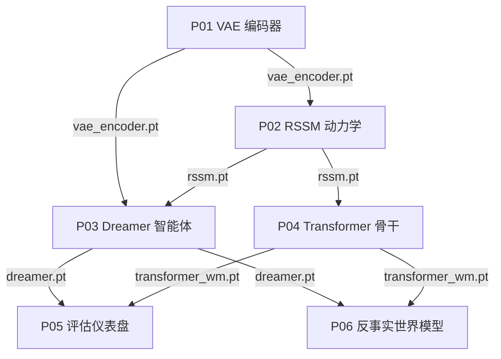

# 项目

六个动手项目从零开始构建一条完整的世界模型流水线。请按顺序完成：P01 的编码器成为 P02 的观测编码器，P02 的动力学模型成为 P03 的骨干网络和 P04 的基线，P03 与 P04 训练出的两套系统在 P05 中进行对比，P06 再对这两套系统的因果保真度进行探查。每个项目都是 notebook 优先的教程，可在 CPU、GPU 或 TPU 上运行，只使用合成数据，并把权重文件继续传给下一步。

## 硬件要求

本章节的每个 notebook 都是在 Google Colab 上使用单块 T4 GPU 开发并运行的。如果你拥有相当或更高的算力，也就是同代或更新的 Nvidia GPU、AMD GPU 或 TPU，便可以无需任何改动地运行全部五个项目。在 Colab 上，我们建议订阅 [Colab Pro](https://colab.research.google.com/signup)，因为免费版只是偶尔才会有闲置的 T4 可用，付费方案能提供这些项目所依赖的稳定算力。

这些 markdown 页面只保留叙述文字和代码。所有 output、图表、表格和其他产物都请到对应的 `.ipynb` 文件中查看。

打开任意 notebook 并从头到尾运行即可；如果上游权重缺失，notebook 会回退到随机初始化，仍可作为冒烟测试，但只有在真实权重就位后，跨项目的对比结果才具有意义。

## 项目流程

| # | 项目 | 前置 | 产出 | 交付物 |
|---|------|------|------|--------|
| P01 | [训练 VAE 编码器](./p01_vae_encoder) | L02 Part A | `vae_encoder.pt` | 64×64 帧上的 CNN VAE；ELBO 损失曲线；展示解耦维度的潜在遍历 |
| P02 | [构建 RSSM 动力学模型](./p02_rssm_dynamics) | P01、L02 Part B | `rssm.pt` | GRU、MDN-RNN 与 RSSM 对比；rollout 图；1 步到 5 步预测误差曲线 |
| P03 | [训练 Dreamer 智能体](./p03_dreamer_agent) | P02、L03 Part B | `dreamer.pt` | 编码器 + RSSM + 潜在 Actor-Critic 训练循环；奖励曲线；FID 与奖励相关性自评 |
| P04 | [替换动力学骨干网络](./p04_transformer_backbone) | P02、L03 Part A | `transformer_wm.pt` | 用 STORM 风格的类别 VAE 加因果 Transformer 替换 RSSM；架构对比报告 |
| P05 | [世界模型评估仪表盘](./p05_evaluation_dashboard) | P03、P04、L04 | -- | 加载两套训练好的模型并排打分：PSNR、奖励相关性、token 损失与潜在漂移 |
| P06 | [反事实的动作条件世界模型](./p06_counterfactual_world_model) | P03、P04 | `causal_wm.pt` | 因果之梯分析：干预与反事实推演、逆动力学正则化的世界模型，以及动作影响度指标 |

## 权重文件如何串联

各项目共享一组在流水线中向前传递的权重文件。P01 训练 VAE 并写出 `vae_encoder.pt`。P02 加载该编码器，训练动力学模型，写出 `rssm.pt`。此后路径分叉：P03 把编码器和 RSSM 组合成 Dreamer 智能体，保存为 `dreamer.pt`；P04 则复用 RSSM 作为基线，训练 Transformer 骨干，保存为 `transformer_wm.pt`。P05 加载 `dreamer.pt` 与 `transformer_wm.pt` 完成准确度评估。P06 再加载同样的两套权重来探查因果保真度，并训练一个自有的动作正则化模型，保存为 `causal_wm.pt`。

